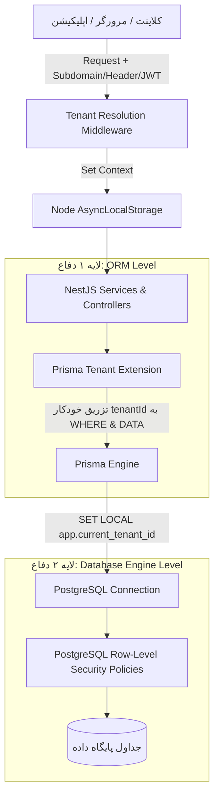
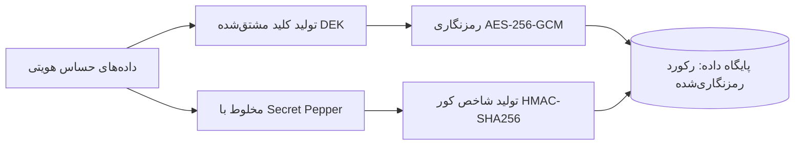

# سند جامع معماری پلتفرم رکاد (Rokad Platform Architecture)

## ۱. معرفی و چشم‌انداز پلتفرم
پلتفرم رکاد یک سامانه یکپارچه **SaaS چندمستأجری (Multi-Tenant)** برای مدیریت هوشمند مراکز آموزشی و مدارس (School ERP & LMS) است.
این سیستم به گونه‌ای طراحی شده که در وهله اول شعب **مدرسه رکاد (پسرانه و دخترانه)** را با بالاترین کیفیت، هویت بصری منطبق بر Design System و عملکرد بلادرنگ پشتیبانی کند، و همزمان معماری آن قابلیت میزبانی صدها مرکز آموزشی را در قالب سرویس ابری (Cloud SaaS) با ایزولاسیون کامل داده‌ها داشته باشد.

---

## ۲. پشته فناوری (Technology Stack)

| لایه | فناوری | نقش و اهمیت |
|---|---|---|
| **بک‌اند** | Node.js + NestJS (TypeScript) | معماری ماژولار مبتنی بر DI، ساختار منظم فازها، گاردها و پایپ‌های اعتبارسنجی |
| **پایگاه داده** | PostgreSQL 16+ | پشتیبانی از JSONB، امنیت در سطح سطر (RLS) و کارایی بالا در ایندکس‌های ترکیبی |
| **ORM** | Prisma ORM | مدیریت Migration، تایپ‌سیفتی کامل و قابلیت اکستنشن برای تفکیک چندمستأجری |
| **کش و صف** | Redis 7+ / BullMQ | کشینگ سریع رکوردهای تننت و فلگ‌ها، صف‌های غیرهمگام (SMS/Audit/Reports) |
| **ذخیره‌سازی فایل** | MinIO / S3 Compatible | ذخیره اسناد، تصاویر پروفایل و محتوای آموزشی LMS |
| **بلادرنگ (Real-time)** | Socket.IO + Redis Adapter | چت کلاسی، رخدادهای زنده و سیستم پوش‌نوتیفیکیشن |
| **کلاس آنلاین** | Jitsi / BigBlueButton | برگزاری وبینارها و جلسات آموزشی آنلاین |
| **فرانت‌اند** | Next.js (React) + TypeScript | رندرینگ SSR برای پرتال عمومی مدارس + SPA برای پنل‌های مدیریتی |

---

## ۳. معماری چندمستأجری: دفاع دو لایه (Defense-in-Depth Multi-Tenancy)

برای تضمین ۱۰۰٪ عدم نشت اطلاعات میان مدارس و شعب (Zero Tenant Data Leakage)، سیستم از دو لایه دفاعی کاملاً مستقل استفاده می‌کند:



### ۳.۱ لایه اول: Prisma Client Extensions + AsyncLocalStorage
* در هر درخواست HTTP، شناسه `tenant_id` از طریق ساب‌دامین (`rokad-boys.rokadschool.ir`)، هدر `x-tenant-slug` یا توکن JWT استخراج و در `AsyncLocalStorage` ذخیره می‌شود.
* افزونه اختصاصی Prisma (`prisma-tenant.extension.ts`) در تمام عملیات `findMany`، `findFirst`، `create`، `update` و `delete` به صورت خودکار شرط `where: { tenantId }` و فیلد `data: { tenantId }` را تزریق می‌کند؛ بنابراین هیچ برنامه‌نویسی نمی‌تواند فیلتر مدرسه را فراموش کند.

### ۳.۲ لایه دوم: PostgreSQL Row-Level Security (RLS)
* در سطح جداول دیتابیس، سیاست‌های امنیتی RLS تعریف شده است:
  ```sql
  ALTER TABLE "User" ENABLE ROW LEVEL SECURITY;
  CREATE POLICY tenant_isolation_policy ON "User"
    USING ("tenantId" = current_setting('app.current_tenant_id', true));
  ```
* قبل از اجرای کوئری‌ها یا در سطح تراکنش، مقدار `app.current_tenant_id` ست می‌شود؛ به این ترتیب حتی اجرای مستقیم Raw SQL هم قادر به عبور از مرز تننت نخواهد بود.

---

## ۴. ایندکس‌گذاری و کارایی Shared Schema
تمام جداول وابسته به مدرسه دارای ایندکس‌های ترکیبی پیشونددار هستند:
* `@@index([tenantId, createdAt])` — جهت گزارش‌گیری زمانی و صفحه‌بندی سریع
* `@@index([tenantId, role])` — تفکیک سریع کاربران بر اساس نقش در یک مدرسه
* `@@unique([tenantId, email])` — امکان تعریف ایمیل یکسان در شعب مختلف در صورت لزوم
* `@@unique([tenantId, phone])` — یکتایی شماره همراه در سطح هر مدرسه

---

## ۵. امنیت توکن‌ها (Token Family & Reuse Detection)
برای جلوگیری از سرقت سشن و توکن‌های Refresh:
1. هر سشن لاگین یک `Token Family` دارد.
2. با هر درخواست رفرش، یک توکن جدید صادر و توکن قبلی به عنوان «استفاده‌شده (`isUsed = true`)» علامت می‌خورد (Rotation).
3. **تشخیص سرقت:** اگر توکنی که قبلاً `isUsed = true` شده مجدداً برای رفرش ارسال شود، نشان‌دهنده نشت توکن است. سیستم بلافاصله کل `Token Family` را باطل (`isRevoked = true`) کرده و کاربر را مجبور به لاگین مجدد می‌کند.

---

## ۶. سیستم Feature Flag به ازای تننت
* هر قابلیت ماژولار (مانند `lms_online_exam`, `finance_salary`, `sms_notification`) در جدول `FeatureFlag` تعریف می‌شود.
* در جدول `TenantFeatureFlag` می‌توان هر قابلیت را برای یک مدرسه خاص (مثلاً شعبه پسرانه فعال، شعبه دخترانه غیرفعال) Override کرد.
* گارد `@RequireFeature('lms_online_exam')` دسترسی کنترلرها را در سطح کد محافظت می‌کند.
* وضعیت فلگ‌ها در Redis کش می‌شود تا تأخیری در پردازش درخواست‌ها ایجاد نشود.

---

## ۷. ارتباط سیستم طراحی (Design System) با تننت‌ها
تنظیمات تننت شامل فیلد تم برند از ۵ پرسونای رکاد است:

| کلید تم | نام شعبه / بخش | رنگ اصلی (Primary) | سایه برند (Hard Shadow) |
|---|---|---|---|
| `Ecosystem` | پلتفرم مرکزی / سوپرادمین | `#59BBAF` | `2.75px 2.75px 0 #59BBAF` |
| `Male` | شعبه پسرانه رکاد (`rokad-boys`) | `#202A5A` | `2.75px 2.75px 0 #202A5A` |
| `Female` | شعبه دخترانه رکاد (`rokad-girls`) | `#E0195B` | `2.75px 2.75px 0 #E0195B` |
| `College` | بخش دانشگاهی / کالج | `#F8A41D` | `2.75px 2.75px 0 #F8A41D` |
| `Club` | باشگاه و انجمن‌ها | `#652D90` | `2.75px 2.75px 0 #652D90` |

---

## ۸. معماری سوئیت امنیتی Zero-Trust و رمزنگاری داده‌ها

سامانه رکاد مجهز به یک لایه امنیتی دفاع در عمق (Defense-in-Depth) مستقل از منطق تجاری است:



1. **رمزنگاری پاکتی (Envelope Encryption):**
   - هر رکورد هویتی (کد ملی، شماره تلفن) با الگوریتم **AES-256-GCM** و بردار تصادفی ۹۶ بیتی (IV) رمزنگاری می‌شود.
   - کلید اصلی رمزنگاری (`MASTER_ENCRYPTION_KEY`) در حافظه محافظت شده و کلید مشتق‌شده هر فیلد درون تگ احراز اصالت ذخیره می‌گردد.
2. **شاخص‌گذاری کور (Blind Indexing):**
   - برای جستجوی مستقیم کدهای ملی رمزنگاری‌شده بدون نیاز به رمزگشایی کل جدول، از هش رمزنگاری‌شده HMAC-SHA256 به همراه نمک محرمانه سمت سرور استفاده می‌شود.
3. **لاگ‌های زنجیره‌ای وقایع با لنگر خارجی تلگرام (Chained Audit Logs & External Anchor):**
   - تمامی رخدادهای سیستمی دارای فیلد `previousHash` هستند که یک زنجیره هش ناگسستنی (Blockchain-like Hash Chain) ایجاد می‌کند.
   - یک کرون‌جاب دوره‌ای، هش وضعیت لاگ‌ها را در یک کانال خصوصی تلگرام ثبت می‌کند (`External Anchor`) تا از عدم دستکاری لاگ‌ها توسط دسترسی‌های محلی دیتابیس اطمینان حاصل شود.

---

## ۹. معماری موتور مالی و خزانه‌داری چک‌های صیادی

1. **مهاجرت به `Decimal(15, 2)`:**
   - به منظور حذف کامل خطاهای ممیز شناور IEEE 754 در محاسبات ریالی و تومانی، کلیه فیلدهای مالی در سطح Prisma و PostgreSQL از نوع `Decimal` هستند.
2. **طرح‌های شهریه سال تحصیلی (`FeePlan`):**
   - طرح‌های شهریه به صورت ماژولار با دامنه‌های `ALL_SCHOOL`، `EDUCATIONAL_LEVEL` یا `CLASSROOM` پیکربندی شده و تخصیص گروهی بدهی با ترنزکشن اتمیک صورت می‌پذیرد.
3. **ماشین وضعیت چک‌های صیادی (`Sayad Cheque State Machine`):**
   - وضعیت اولیه: `PENDING` (بدون کسر از مانده بدهی).
   - وضعیت وصول: `CASHED` (کسر خودکار از مانده بدهی و صدور رسید معتبر).
   - وضعیت برگشت: `BOUNCED` (فعال‌سازی خودکار پرچم `hasFinancialHold = true` و ثبت دلیل).
   - وضعیت جایگزینی: `REPLACED` (پیوند سند نقدی یا چک جدید به چک برگشتی).

---

## ۱۰. همگام‌سازی بلادرنگ توزیع‌شده (Real-Time Architecture)

* چت سازمانی و هشدارهای فوری بر بستر **Socket.io 4** پیاده‌سازی شده است.
* جهت تضمین مقیاس‌پذیری افقی روی چند نمونه کانتینر، از `@socket.io/redis-adapter` استفاده شده تا رویدادهای WebSocket میان تمام نمونه‌های سرور به صورت Real-time همگام شوند.

