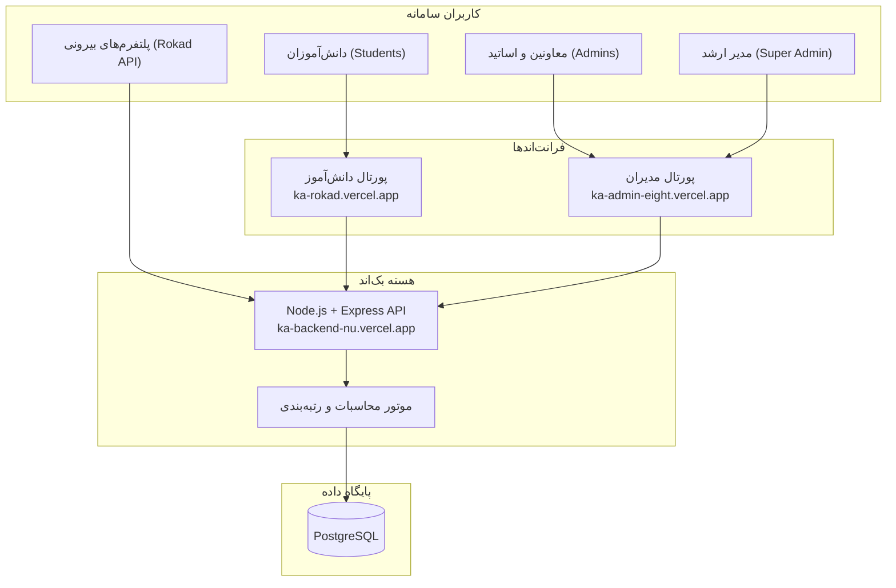
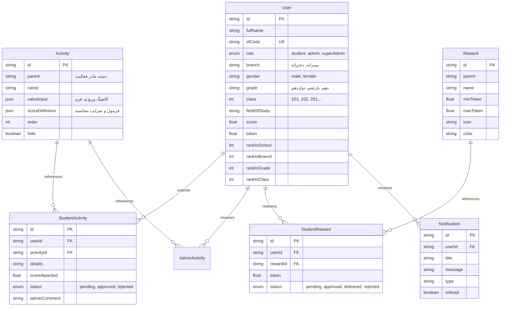
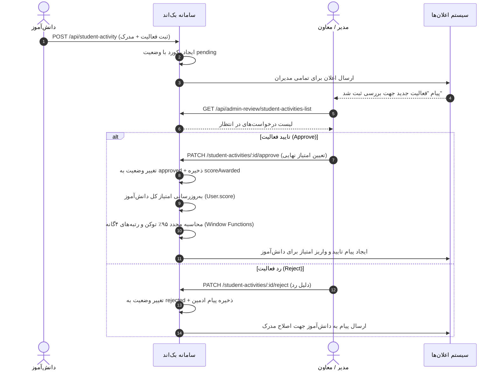

# مستند جامع معماری، لاجیک‌ها و سازوکار ۰ تا ۱۰۰ سامانه KA-Platform
## Comprehensive Product, Architecture & Logic Specification

---

## ۱. معرفی محصول و چشم‌انداز (Executive Summary)

**KA-Platform (سامانه هوشمند و گیمیفیکیشن هنرستان کا)** یک اکوسیستم جامع آموزشی، مهارتی و انگیزشی است که با هدف ارتقای مشارکت دانش‌آموزان، توسعه مهارت‌های فردی و فنی، و دیجیتالی‌سازی فرآیندهای نظارتی و تشویقی مدارس طراحی شده است.

این سامانه متکی بر یک موتور **گیمیفیکیشن (Gamification Engine)** است که رفتارهای مثبت دانش‌آموزان (نظیر پیشرفت در معدل، انجام پروژه‌های واقعی کارگاهی، کارآموزی، فعالیت‌های داوطلبانه و کتابخوانی) را به **امتیاز (Score)** و **توکن قابل خرج (Token)** تبدیل می‌کند. در عین حال، موارد انضباطی یا تاخیرها از طریق ماژول کسر امتیاز رصد می‌شوند.

---

## ۲. بازیگران و پورتال‌های سامانه (Actors & Portals)

سامانه از سه پرتال مستقل به همراه یک هسته بک‌اند تشکیل شده است:

### ۲.۱. پورتال دانش‌آموز (Student Portal)
- **داشبورد تحلیلی:** نمایش امتیاز کل، توکن‌های قابل خرج، جایگاه دانش‌آموز در مدرسه، شعبه، پایه و کلاس.
- **کارتابل ثبت فعالیت:** فرم داینامیک جهت بارگذاری مدارک فعالیت‌های مهارتی، کارگاهی و آموزشی.
- **فروشگاه و باشگاه پاداش‌ها (Rewards Store):** مشاهده جوایز متنوع (دیجیتال، فیزیکی و نیکوکارانه) و خرید با توکن.
- **لیدربورد (Leaderboard):** مقایسه رتبه با هم‌کلاسی‌ها، هم‌پایه‌ای‌ها و شعب دیگر.

### ۲.۲. پورتال مدیریت و معاونت (Admin Portal)
- **میز کار بررسی (Review Desk):** مشاهده صف فعالیت‌های ارسالی دانش‌آموزان، اعتبارسنجی مدارک، تایید با امتیاز یا رد با ارسال بازخورد.
- **میز کار پاداش‌ها (Reward Fulfillment):** رهگیری سفارش‌های جوایز، تغییر وضعیت به تایید شده یا تحویل داده شده فیزیکی.
- **ثبت مستقیم تشویق/کسر امتیاز:** ثبت مستقیم موارد انضباطی یا جوایز کلاسی بدون نیاز به درخواست دانش‌آموز.
- **گزارش‌گیری تحلیلی:** استخراج فایل‌های اکسل و آمار تفکیکی شعب و کلاس‌ها.

### ۲.۳. پورتال مدیر ارشد (SuperAdmin)
- تعریف و دسته‌بندی فعالیت‌ها (تعیین فرمول محاسبه امتیاز، ضریب، فیلدهای ورودی).
- مدیریت جوایز (تعیین سقف توکن، موجودی، رنگ، آیکون).
- ایمپورت کاربران از فایل اکسل و پیکربندی ساختار سال تحصیلی.

---

## ۳. مدل داده و ساختار پایگاه‌داده (Database Architecture)

پایگاه‌داده بر روی **PostgreSQL** پیاده‌سازی شده و از طریق **Prisma ORM** مدیریت می‌شود:

---

## ۴. منطق‌های محاسباتی و بیزینس لاجیک‌ها (Core Logics)

### ۴.۱. منطق محاسبه توکن‌های قابل خرج (قانون ۹۵٪)
برای ایجاد حس دارایی ارزشمند و حفظ اعتبارات تاریخی:
1. امتیاز کسب‌شده (`score`) نشان‌دهنده **اعتبار و سابقه تاریخی دانش‌آموز** است و حتی با خرید جایزه هرگز کسر نمی‌شود.
2. توکن قابل خرج (`spendableTokens`) معادل **۹۵ درصد کل امتیاز** است:
$$\text{Spendable Tokens} = \lfloor \text{score} \times 0.95 \rfloor$$
- ۵ درصد باقیمانده به عنوان پشتوانه اعتباری ذخیره می‌ماند.

### ۴.۲. فرمول محاسبه امتیاز فعالیت‌ها (Dynamic Score Engine)
هر فعالیت تعریف‌شده در سامانه شامل یک شیء کانفیگ به نام `scoreDefinition` است:
- **روش محاسباتی (`calculated_from_value`):**
  $$\text{Score} = \min(\max(\text{Value} \times \text{Multiplier}, \text{Min}), \text{Max})$$
  *مثال:* معدل نوبت اول = نمره کارنامه ($۱۹.۵$) $\times$ ضریب ($۵$) = ۹۷.۵ امتیاز.
- **روش انتخابی (`select_from_enum`):**
  دانش‌آموز از بین گزینه‌های از پیش تعریف‌شده انتخاب می‌کند (مثلاً مطالعه کتاب بالای ۲۰۰ صفحه = ۲۰ امتیاز).

### ۴.۳. منطق رتبه‌بندی چند سطحی (Multilevel Window Ranking Logic)
سامانه با استفاده از توابع تحلیلی پنجره‌ای پایگاه‌داده PostgreSQL (`DENSE_RANK() OVER`) در ۴ سطح مستقل و هم‌زمان دانش‌آموزان را رتبه‌بندی می‌کند:

$$\begin{aligned}
\text{rankInSchool} &= \text{DENSE\_RANK}() \text{ OVER } (\text{ORDER BY score DESC}) \\
\text{rankInBranch} &= \text{DENSE\_RANK}() \text{ OVER } (\text{PARTITION BY branch ORDER BY score DESC}) \\
\text{rankInGrade} &= \text{DENSE\_RANK}() \text{ OVER } (\text{PARTITION BY grade ORDER BY score DESC}) \\
\text{rankInClass} &= \text{DENSE\_RANK}() \text{ OVER } (\text{PARTITION BY grade, class ORDER BY score DESC})
\end{aligned}$$

- **ویژگی DENSE_RANK:** در صورت برابری امتیاز دو دانش‌آموز، رتبه یکسان دریافت کرده و شماره رتبه بعدی جا نمی‌افتد (مثلاً: ۱، ۱، ۲).
- **به‌روزرسانی خودکار:** به محض تایید هر فعالیت یا کسر امتیاز توسط ادمین، کل رتبه‌بندی‌های دیتابیس مجدداً محاسبه می‌شوند.

---

## ۵. گردش کار ثبت و بررسی فعالیت‌ها (Activity Lifecycle)

---

## ۶. گردش کار فروشگاه و تحویل پاداش‌ها (Rewards Lifecycle)

1. **بررسی موجودی توکن:**
   - دانش‌آموز جایزه مورد نظر را انتخاب می‌کند.
   - سامانه بررسی می‌کند که آیا $\text{User.token} \ge \text{Reward.minToken}$ است یا خیر.
2. **ثبت رزرو:**
   - در صورت کفایت موجودی، رکورد در جدول `StudentReward` با وضعیت `pending` ایجاد می‌شود.
3. **کسر توکن:**
   - هزینه جایزه از توکن‌های در دسترس کسر می‌گردد.
4. **تایید و تحویل فیزیکی:**
   - مدیر در پنل خود لیست درخواست‌های پاداش را می‌بیند (`GET /api/student-reward/rewards-list`).
   - پس از تحویل ماگ، فلش‌مموری یا فعال‌سازی دوره، وضعیت به `delivered` تغییر می‌یابد:
     `PATCH /api/student-reward/:id` با `{ "status": "delivered" }`.

---

## ۷. دسته‌بندی فعالیت‌ها (Activity Taxonomy)

فعالیت‌ها در سامانه به ۴ دسته اصلی تقسیم شده‌اند:

| دسته اصلی | نمونه فعالیت‌ها | نحوه ارزیابی | اثر بر امتیاز |
| :--- | :--- | :--- | :--- |
| **فعالیت‌های آموزشی** | معدل نوبت اول/دوم، نمرات مهارتی، المپیادها | کارنامه / آزمون استاندارد | مثبت (+) |
| **فعالیت‌های شغلی** | کارآموزی در شرکت‌ها، پروژه واقعی برای کارفرما | قرارداد / تاییدیه کارفرما | مثبت (+) |
| **توسعه فردی و داوطلبانه** | کتابخوانی تخصصی، ارائه کارگاه، همکاری در رویدادها | گزارش خلاصه کتاب / پوستر | مثبت (+) |
| **موارد کسر امتیاز** | تاخیر غیرموجه در کلاس، تاخیر در تحویل پروژه | گزارش ناظم / دبیر کارگاه | منفی (-) |

---

## ۸. امنیت، استانداردها و نکات پیاده‌سازی (Security & Performance)

1. **امنیت پسوردها:**
   - تمامی رمزها با الگوریتم **Bcrypt** با سالت ۱۰ هش می‌شوند.
2. **یکسان‌سازی ارقام (Digit Normalization):**
   - کدهای ملی چه با ارقام انگلیسی (`1234567890`) و چه با ارقام فارسی (`۱۲۳۴۵۶۷۸۹۰`) یا عربی ارسال شوند، پیش از جستجو و ذخیره‌سازی به ارقام استاندارد انگلیسی تبدیل می‌شوند تا از خطای عدم تطابق ورود جلوگیری گردد.
3. **میدل‌ورهای اعتبارسنجی:**
   - `isLogin`: اعتبارسنجی امضای JWT و انقضای توکن.
   - `isAdmin`: احراز سطح دسترسی `admin` یا `superAdmin`.
   - `isSuperAdmin`: تفکیک دسترسی‌های حساس مدیریتی.
4. **ایندکس‌های دیتابیس برای پاسخ‌دهی میلی‌ثانیه‌ای:**
   - ایندکس یکتا روی `idCode`
   - ایندکس ترکیبی `[role, score DESC]` برای استخراج آنی لیدربورد
   - ایندکس ترکیبی `[grade, class]` جهت فیلتر پرسرعت کلاسی
   - ایندکس روی `branch` جهت تفکیک بلادرنگ شعب پسرانه و دخترانه

---

## ۹. جمع‌بندی و راهنمای پیاده‌سازی برای تیم‌های یکپارچه‌ساز

- تمام مسیرهای داده‌ای سامانه تست شده و با استاندارد RESTful مطابقت دارند.
- پلتفرم‌های بیرونی نظیر راکد می‌توانند از طریق آدرس `https://ka-backend-nu.vercel.app/api/leaderboard` اطلاعات تفکیکی هر شعبه، پایه و کلاس را با سرعت و ساختار یکپارچه دریافت و در داشبوردهای خود نمایش دهند.
- کلیه سورس‌کدها در ریپازیتوری با پوشش کامل تست‌های خودکار مستقر هستند.
