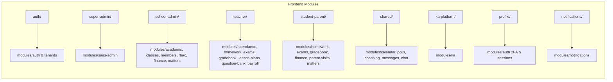

# سند جامع شناخت و تحلیل معماری پلتفرم رُکاد (Rokad Platform)
**نسخه گزارش:** ۱.۰.۰  
**تاریخ تحلیل:** ۳۱ شهریور ۱۴۰۵ (2026-09-21)  
**وضعیت:** تکمیل مأموریت درک سیستم و بدون اعمال هرگونه تغییر کدی در سامانه

---

## ۱. خلاصه معماری کلی سیستم (Executive Architectural Summary)

«پلتفرم رُکاد» یک سامانه سازمانی یکپارچه چندمستأجری ابری (Multi-Tenant Cloud SaaS) از نوع School ERP & LMS و سیستم‌عامل جامع مراکز آموزشی است که برای میزبانی هم‌زمان مدارس اختصاصی رُکاد (شعب پسرانه، دخترانه، کالج، باشگاه) و همچنین صدها مرکز آموزشی مستقل با اصل عدم نشت داده (Zero Tenant Data Leakage) مهندسی شده است.

معماری سامانه از دو بخش اصلی و هماهنگ تشکیل شده است:
1. **هسته بک‌اند (NestJS 10 + TypeScript Strict):** مبتنی بر تفکیک دامنه‌ای ماژولار (Clean Modular Architecture)، ارتباط با پایگاه داده PostgreSQL 16 از طریق Prisma ORM (با توسعه‌های سفارشی Prisma Client Extensions و سیاست‌های PostgreSQL RLS)، لایه کش و صف توزیع‌شده با Redis 7 و BullMQ، سیستم ذخیره‌سازی داده‌های حجیم و پیوست‌ها با MinIO (S3-Compatible)، همگام‌سازی بلادرنگ رویدادها و پیام‌رسانی از طریق Socket.IO 4 به همراه `@socket.io/redis-adapter` برای مقیاس‌پذیری افقی چندکانتینری، و یک سوئیت امنیتی Zero-Trust.
2. **لایه فرانت‌اند (React 18 + Vite 6 + TypeScript):** وب‌اپلیکیشن پیش‌رونده (PWA) با قابلیت کارکرد آفلاین، متمرکز بر ۵ پرسونا و نقش کاربری متمایز (Super Admin، School Admin & Staff، Teacher، Student، Parent)، با طراحی منطبق بر دیزاین‌سیستم رُکاد (پشتیبانی از تم‌های ۵‌گانه Ecosystem، Male، Female، College، Club)، تایپوگرافی فارسی IRANSansXFaNum، محاسبات دقیق تقویم جلالی/شمسی، و استفاده از TanStack Query (React Query v5) و Zustand برای مدیریت وضعیت داده‌ها.

جریان درخواست‌های ورودی به این صورت است که کلاینت درخواست را به همراه ساب‌دامین، دامنه اختصاصی، یا هدرهای `x-tenant-id` و `x-tenant-slug` ارسال می‌کند. یک میدلور سراسری بر بستر Node.js `AsyncLocalStorage` کانتکست مدرسه جاری را شناسایی و کش می‌کند. سپس درخواست از گارد‌های سراسری احراز هویت JWT، کنترل نقش (RolesGuard)، کنترل مجوزها (PermissionsGuard)، و در موارد حساس گارد احراز هویت مرحله‌ای (StepUpGuard) عبور کرده و وارد ماژول‌های مستقل دامنه می‌شود. کلیه لاگ‌های تغییرات از طریق یک اینترسپتور به موتور ممیزی زنجیره‌هش‌شده هدایت می‌شوند.

---

## ۲. جدول ماژول‌های بک‌اند (مسئولیت، مدل‌ها، وابستگی‌ها، اندپوینت‌ها و سطوح دسترسی)

در جدول زیر، تمامی ۲۹ ماژول شناسایی‌شده در پوشه `src/modules/` به همراه مشخصات فنی دقیق آورده شده است:

| # | نام ماژول | مسئولیت اصلی | مدل‌های Prisma مرتبط | وابستگی‌ها و ماژول‌های مصرفی | اندپوینت‌های کلیدی | پرمیشن‌ها و نقش‌های مجاز |
|---|---|---|---|---|---|---|
| ۱ | **academic** | مدیریت سال‌های تحصیلی، نیم‌سال‌ها/ترم‌ها، مقاطع تحصیلی و رشته‌ها | `AcademicYear`, `Term`, `EducationalLevel`, `StudyField` | `PrismaService`, `TenantContextService` | `GET/POST /academic/years` `POST /academic/terms` `GET/POST /academic/levels` `GET/POST /academic/fields` | `academic.year.write` `academic.level.write` `academic.field.write` (SUPER_ADMIN, SCHOOL_ADMIN, STAFF) |
| ۲ | **attendance** | ثبت سریع و گروهی حضور و غیاب دانش‌آموزان و معلمان، تاخیر، غیبت موجه، آمار روزانه | `StudentAttendance`, `TeacherAttendance`, `Classroom`, `ClassEnrollment` | `PrismaService`, `RedisService`, `EventEmitter2` (ارسال هشدار به والدین) | `POST /attendance/students/bulk` `GET /attendance/classroom/:id` `GET /attendance/student/:id` `GET /attendance/daily-stats` `POST /attendance/teachers` | `attendance.read` `attendance.write` (SUPER_ADMIN, SCHOOL_ADMIN, TEACHER, STAFF) |
| ۳ | **audit-log** | ثبت تغییرات سیستمی به صورت زنجیره هش ناگسستنی (Blockchain-like)، لنگر خارجی و راستی‌آزمایی ریاضی | `AuditLog` | `PrismaService`, `EncryptionService`, `RedisService`, `TelegramAnchorService` | `GET /audit-logs` `GET /audit-logs/verify` | SUPER_ADMIN, SCHOOL_ADMIN |
| ۴ | **auth** | ثبت‌نام اولیه مدرسه، ورود چندمستأجری، Token Family Rotation، احراز هویت دوعاملی (2FA TOTP)، مدیریت سشن‌های فعال | `User`, `RefreshTokenFamily`, `RefreshToken`, `UserSession` | `PrismaService`, `EncryptionService`, `RedisService`, `BruteForceService`, `JwtService` | `POST /auth/register-school` `POST /auth/login` `POST /auth/2fa/*` `POST /auth/refresh` `POST /auth/logout` `GET/DELETE /auth/sessions/*` `GET /auth/admin/users/:id/sessions` | عمومی (Public برای لاگین/ثبت‌نام) JwtAuthGuard (برای پروفایل و سشن‌ها) StepUpGuard (برای مدیریت سشن دیگران) |
| ۵ | **calendar** | تقویم آموزشی شمسی، رویدادها و مناسبت‌ها، رودمپ اجرایی مدرسه، تعطیلات رسمی و سازمانی | `SchoolEvent` (Soft Delete), `OfficialHoliday`, `TenantHoliday` | `PrismaService`, `jalaali-js`, `jalaliday` | `GET/PUT /calendar/event-types` `GET/POST /calendar/events` `PATCH/DELETE /calendar/events/:id` `GET/POST /calendar/holidays/*` | `calendar.write` (SUPER_ADMIN, SCHOOL_ADMIN, STAFF; مشاهده برای همه نقش‌ها) |
| ۶ | **chat** | کانال‌های گفتگوی ۲‌نفره مستقیم و گروه‌های کلاسی، تبادل پیام و پیوست، ارسال بلادرنگ با Socket.io | `ChatChannel`, `ChatChannelMember`, `ChatMessage` | `PrismaService`, `StorageService` (MinIO), `Socket.io`, `RedisAdapter` | `POST /chat/channels/direct` `POST /chat/channels/class` `GET /chat/channels` `GET/POST /chat/channels/:id/messages` WS Namespace: `/chat` | کاربران احراز هویت شده (کلاس برای TEACHER, SCHOOL_ADMIN, STUDENT) |
| ۷ | **classes** | مدیریت کاتالوگ دروس و پودمان‌ها، کلاس‌های درس، ثبت‌نام و تخصیص دانش‌آموزان، برنامه هفتگی | `Lesson`, `Classroom`, `ClassEnrollment`, `ClassSchedule`, `TeacherLesson` | `PrismaService`, `TenantContextService` | `GET/POST /classes/lessons` `GET/POST /classes/classrooms` `POST/DELETE /classes/classrooms/:id/enroll` `GET/POST /classes/schedules` | `lesson.write`, `classroom.write`, `schedule.write`, `enrollment.write` (SUPER_ADMIN, SCHOOL_ADMIN, STAFF, TEACHER) |
| ۸ | **coaching** | مدیریت سیستم منتورینگ و کوچینگ، تخصیص دانش‌آموز به کوچ، ثبت جلسات دوره‌ای و جلسات فوق‌العاده | `StudentCoachLink`, `CoachingSession`, `CoachingExtraRequest`, `CoachProfile` | `PrismaService`, `EventEmitter2` | `GET /coaching/my-context` `GET /coaching/today` `GET /coaching/students` `POST /coaching/assign` `PATCH /coaching/sessions/:id` `POST/PATCH /coaching/extra-requests/*` | `coaching.read`, `coaching.write` (COACH, STUDENT, SCHOOL_ADMIN, SUPER_ADMIN) |
| ۹ | **exams** | موتور جامع آزمون (آنلاین، تستی، تشریحی)، شافل سوالات، ترکینگ تعویض تب (ضد تقلب)، تصحیح خودکار و نمره ارفاقی | `Exam`, `ExamClassroom`, `ExamQuestion`, `ExamParticipation`, `ExamAnswer` | `PrismaService`, `QuestionBankService`, `EventEmitter2` | `POST /exams` `GET /exams` `POST /exams/:id/questions` `POST /exams/:id/publish` `POST /exams/:id/start` `POST /exams/:id/submit` `POST /exams/:id/record-tab-switch` `POST /exams/:id/participations/:pId/grade` | `exam.read`, `exam.write` (TEACHER, SCHOOL_ADMIN, STAFF, STUDENT برای شرکت) |
| ۱۰ | **feature-flags** | فعال/غیرفعال‌سازی ماژولار امکانات به ازای هر مدرسه (Multi-Tenant Feature Toggles) همراه با کشینگ ردیس | `FeatureFlag`, `TenantFeatureFlag` | `PrismaService`, `RedisService` | `GET /feature-flags/my-school` `POST /feature-flags/my-school/toggle` `GET/POST /feature-flags/tenants/:id/*` | SUPER_ADMIN, SCHOOL_ADMIN, STAFF |
| ۱۱ | **finance** | موتور مالی، پلن‌های شهریه (`FeePlan`)، قراردادهای دانش‌آموز (`StudentFeeContract`)، درگاه زرین‌پال با Idempotency Lock، خزانه‌داری چک صیادی ۱۶ رقمی، یادآور سررسید چک، ایمپورت اکسل ۲ مرحله‌ای | `FeePlan`, `StudentFeeContract`, `FeeInstallment`, `PaymentTransaction`, `FeePayment`, `FeeReceipt` | `PrismaService`, `RedisService`, `EventEmitter2`, `ZarinpalProvider` | `GET/POST /finance/fee-plans` `POST /finance/fee-plans/:id/apply` `GET /finance/contracts/my-children` `POST /finance/payments/online/initiate` `GET /finance/payments/verify` `POST /finance/payments/cash` `POST /finance/payments/cheque` `PATCH /finance/payments/cheques/:id/status` `POST /finance/fees/import/*` | `finance.fee.read` `finance.fee.write` `finance.check.manage` `finance.fee.import` (SUPER_ADMIN, SCHOOL_ADMIN, PARENT) |
| ۱۲ | **gradebook** | دفتر نمرات مستمر، آزمون‌ها، ارزشیابی شایستگی‌محور پودمانی هنرستان (`PodmanGrade`)، محاسبه کارنامه | `GradeEntry`, `Podman`, `PodmanGrade` | `PrismaService`, `EventEmitter2` | `POST /gradebook/bulk` `POST /gradebook/podman/bulk` `GET /gradebook/matrix` `GET /gradebook/podman/matrix` `GET /gradebook/report-card/:studentId` | `grades.read`, `grades.write` (TEACHER, SCHOOL_ADMIN, STAFF; مشاهده برای STUDENT, PARENT) |
| ۱۳ | **health** | پایش وضعیت سلامت سرویس، پایگاه داده PostgreSQL، کش Redis و فضای سرور (Kubernetes Probes) | ندارد | `@nestjs/terminus`, `PrismaService`, `RedisService` | `GET /health` | عمومی (Public / Unauthenticated) |
| ۱۴ | **homework** | تعریف تکالیف درسی با مهلت و بارم، آپلود فایل در MinIO، ارسال پاسخ دانش‌آموز و ثبت نمره و بازخورد دبیر | `Homework`, `HomeworkSubmission` | `PrismaService`, `StorageService` (MinIO), `EventEmitter2` | `POST /homework/upload` `POST /homework` `GET /homework/classroom/:id` `GET /homework/student/my-pending` `POST /homework/:id/submit` `POST /homework/submissions/:id/grade` | `homework.read`, `homework.write` (TEACHER, SCHOOL_ADMIN, STAFF, STUDENT) |
| ۱۵ | **ka** | سیستم گیمیفیکیشن و انگیزش پلتفرم کـا: تعریف فعالیت‌های امتیازی، محاسبه فرمولی توکن، فروشگاه پاداش‌ها | `KaActivity`, `KaStudentActivity`, `KaReward`, `KaStudentReward` | `PrismaService` | `GET/POST /ka-admin/activities` `GET /ka-student/activities` `POST /ka-student/submit` `GET /ka-student/rewards` `POST /ka-student/redeem` `PATCH /ka-admin/submissions/:id` | SUPER_ADMIN, SCHOOL_ADMIN, STAFF, STUDENT |
| ۱۶ | **learning-materials** | بارگذاری جزوات، ویدیوها و اسناد آموزشی کلاسی در MinIO با قابلیت تعیین دانلود و لینک مستقیم | `CourseMaterial`, `MaterialClassroom` | `PrismaService`, `StorageService` (MinIO) | `POST /learning-materials` `DELETE /learning-materials/:id` `GET /learning-materials` `GET /learning-materials/:id` | TEACHER, SCHOOL_ADMIN, STAFF, STUDENT |
| ۱۷ | **lesson-plans** | طرح درس و بودجه‌بندی آموزشی دبیران، ثبت جلسات، اهداف آموزشی، وضعیت پیشرفت و جلسات جبرانی | `LessonPlan`, `LessonPlanSession` | `PrismaService` | `POST /lesson-plans` `GET /lesson-plans` `GET /lesson-plans/:id` `POST /lesson-plans/:id/sessions` `PATCH /lesson-plans/sessions/:id/status` | TEACHER, SCHOOL_ADMIN, STAFF, STUDENT |
| ۱۸ | **matters** | ثبت موارد انضباطی، اخطارها، ارجاع به مشاور، تشویقات و امتیازات مثبت دانش‌آموزان به همراه نوتیفیکیشن والدین | `DisciplinaryMatter` | `PrismaService`, `EventEmitter2` | `POST /matters` `GET /matters/student/:id` `GET /matters` `DELETE /matters/:id` | SUPER_ADMIN, SCHOOL_ADMIN, TEACHER, STAFF, STUDENT, PARENT |
| ۱۹ | **members** | مدیریت مشخصات اعضای مدرسه: دانش‌آموز، دبیر، کادر اداری، مشاور و اولیا، پیوند والد-فرزند، ایمپورت اکسل، رمزنگاری کد ملی | `User`, `StudentProfile`, `TeacherProfile`, `CoachProfile`, `StaffProfile`, `ParentProfile`, `ParentStudentLink` | `PrismaService`, `EncryptionService`, `TenantContextService` | `POST /members/students/bulk-excel` `GET/POST /members/students` `GET/POST /members/teachers` `POST /members/teachers/:id/lessons` `GET/POST /members/coaches` `GET/POST /members/staff` `GET/POST /members/parents` `POST /members/parents/link` | `student.write`, `teacher.write`, `coach.write`, `staff.write`, `parent.write` (SUPER_ADMIN, SCHOOL_ADMIN, STAFF) |
| ۲۰ | **messages** | سیستم مکاتبات و نامه‌نگاری رسمی درون‌سازمانی (صندوق دریافت، ارسال‌شده، ستاره‌دار، بایگانی و سطل زباله) | `AcademicMessage`, `AcademicMessageRecipient` | `PrismaService`, `EventEmitter2` | `POST /messages` `GET /messages/inbox` `GET /messages/sent` `GET /messages/:id` `PATCH /messages/:id/read` `PATCH /messages/:id/star` `DELETE /messages/:id` | تمامی کاربران احراز هویت‌شده سیستم |
| ۲۱ | **notifications** | ارسال و دریافت اعلان‌های سیستمی بر اساس نقش، اشتراک وب‌پوش (WebPush VAPID) روی مرورگر و PWA | `PushSubscription`, `User` | `PrismaService`, `RedisService`, `web-push` | `GET /notifications` `PATCH /notifications/:id/read` `POST /notifications/mark-all-read` `GET /notifications/push/public-key` `POST /notifications/push/subscribe` | تمامی کاربران احراز هویت‌شده سیستم |
| ۲۲ | **parent-visits** | زمان‌بندی جلسات حضوری و آنلاین اولیا با دبیران و مشاورین، رزرو نوبت، تایید، لغو و ثبت بازخورد | `ParentVisitSlot`, `ParentVisitBooking` | `PrismaService`, `EventEmitter2` | `POST/DELETE /parent-visits/slots/*` `GET /parent-visits/my-bookings` `GET /parent-visits/available-slots` `POST /parent-visits/book` `PATCH /parent-visits/bookings/:id/status` | TEACHER, PARENT, SCHOOL_ADMIN, STAFF |
| ۲۳ | **payroll** | محاسبه و صدور فیش حقوق و دستمزد پرسنل و معلمان بر اساس قرارداد ساعتی/ثابت، کارکرد جلسات، تعدیلات، تایید نهایی و خروجی فایل پایا بانکی | `StaffPayrollProfile`, `TeacherContract`, `PayrollSlip`, `PayrollItem`, `PayrollAdjustment` | `PrismaService`, `AttendanceService`, `EventEmitter2` | `POST/GET /finance/payroll/contracts` `POST /finance/payroll/generate-monthly` `GET/PATCH /finance/payroll/slips/*` `POST /finance/payroll/adjustments` `GET /finance/payroll/export/bank-paya` | `finance.payroll.read` `finance.payroll.write` (SUPER_ADMIN, SCHOOL_ADMIN, STAFF, TEACHER) |
| ۲۴ | **polls** | برگزاری نظرسنجی‌ها و فرم‌های رأی‌گیری تک‌گزینه‌ای، چندگزینه‌ای و درجه‌بندی با هدف‌گیری گروه‌های کاربری | `Poll`, `PollOption`, `PollVote` | `PrismaService` | `POST /polls` `GET /polls` `GET /polls/:id` `POST /polls/:id/vote` | SUPER_ADMIN, SCHOOL_ADMIN, TEACHER, COACH, STUDENT, PARENT |
| ۲۵ | **profiles** | مدیریت پروفایل عمومی مدرسه، بیوگرافی، افتخارات، ایجاد وبلاگ و اخبار، ثبت لایک و کامنت، فید رسانه | `SchoolProfile`, `ProfileBlog`, `ProfileBlogLike`, `ProfileBlogComment` | `PrismaService`, `StorageService` (MinIO) | `GET /profiles/school` (Public) `PATCH /profiles/school` `POST/GET /profiles/blogs` `POST /profiles/blogs/:id/like` `POST /profiles/blogs/:id/comments` `GET /media/feed` | `school.profile.write`, `blog.write`, `blog.publish` (SUPER_ADMIN, SCHOOL_ADMIN, STAFF, TEACHER, STUDENT) |
| ۲۶ | **question-bank** | بانک سوالات طبقه‌بندی‌شده بر اساس سرفصل و درس، سطح سختی، نوع سوال (چهارگزینه‌ای، تشریحی) با پشتیبانی فرمول LaTeX | `QuestionCategory`, `Question`, `QuestionOption` | `PrismaService` | `POST/GET /question-bank/categories` `POST/GET /question-bank/questions` `GET/DELETE /question-bank/questions/:id` | TEACHER, SCHOOL_ADMIN, STAFF, SUPER_ADMIN |
| ۲۷ | **rbac** | موتور مدیریت نقش‌ها و پرمیشن‌های پویا، کاتالوگ ۵۰+ دسترسی، تعریف نقش‌های سفارشی، انتساب به کاربر و Overrides | `Permission`, `SchoolRole`, `RolePermission`, `UserSchoolRole`, `UserPermissionOverride` | `PrismaService`, `RedisService` | `GET /rbac/permissions` `GET/POST/PUT/DELETE /rbac/roles/*` `POST /rbac/assign` `POST /rbac/users/:id/roles/sync` `POST /rbac/users/:id/override` `GET /rbac/users/:id/permissions` | `role.read`, `role.write`, `role.assign`, `rbac.manage` (SUPER_ADMIN, SCHOOL_ADMIN) |
| ۲۸ | **saas-admin** | کنترل پنل سوپرادمین پلتفرم: مدیریت تننت‌ها، پلن‌های اشتراک SaaS، قالب‌های نقش سراسری و تنظیمات عمومی پلتفرم | `Tenant`, `SubscriptionPlan`, `TenantSubscription`, `GlobalRoleTemplate`, `GlobalRoleTemplatePermission`, `PlatformSetting` | `PrismaService`, `RedisService` | `GET/POST /saas/tenants/*` `GET/POST /saas/subscriptions/*` `GET/POST /saas/roles/templates/*` `GET/POST /saas/platform/*` | صرفاً `SUPER_ADMIN` یا `isPlatformAdmin` |
| ۲۹ | **tenants** | واکشی اطلاعات عمومی مدرسه (برندینگ، لوگو، تم رنگی، سیستم تقویم)، ویرایش تنظیمات اختصاصی مدرسه جاری | `Tenant` | `PrismaService`, `RedisService` | `GET /tenants/info/:slug` (Public) `GET /tenants/my-school` `PATCH /tenants/my-school` | عمومی (Public برای اسلاگ) SCHOOL_ADMIN, SUPER_ADMIN, STAFF |

---

## ۳. بررسی فرانت‌اند و نگاشت ارتباط با بک‌اند (Frontend-Backend Mapping)

پوشه `frontend/src/modules/` با رویکرد پرسونامحور (Role-Based Personas) سازمان‌دهی شده و تمامی صفحات آن از طریق کلاینت یکپارچه Axios (`frontend/src/lib/api-client.ts`) با اضافه کردن هدر توکن و هدر تننت به بک‌اند متصل هستند:

### نگاشت تفصیلی صفحات فرانت‌اند به اندپوینت‌های بک‌اند:
1. **ماژول `auth` (`frontend/src/modules/auth/LoginPage.tsx`):**
   - به `GET /api/v1/tenants/info/:slug` متصل شده و رنگ تم و برند مدرسه را لود می‌کند.
   - ورود کاربر با `POST /api/v1/auth/login`؛ در صورت وجود دوعاملی به `POST /api/v1/auth/2fa/verify-login` هدایت می‌شود.
2. **ماژول `super-admin` (`frontend/src/modules/super-admin/`):**
   - مدیریت مدارس (`TenantsPage.tsx`) -> `GET/POST /api/v1/saas/tenants`
   - پلن‌های اشتراک (`SubscriptionsPage.tsx`) -> `GET/POST /api/v1/saas/subscriptions/*`
   - قالب نقش‌های کلیدی (`RoleTemplatesPage.tsx`) -> `GET/POST /api/v1/saas/roles/templates`
   - تنظیمات و نگهداری (`PlatformOpsPage.tsx`) -> `GET/POST /api/v1/saas/platform/*`
3. **ماژول `school-admin` (`frontend/src/modules/school-admin/`):**
   - ساختار آموزشی (`academic/AcademicStructurePage.tsx`) -> `/api/v1/academic/*` و `/api/v1/classes/lessons`
   - برنامه هفتگی (`academic/ClassSchedulePage.tsx`) -> `/api/v1/classes/schedules`
   - دایرکتوری اعضا (`members/MembersPage.tsx`) -> `/api/v1/members/students` (به همراه ایمپورت اکسل)، `/members/teachers` و غیره.
   - سازنده نقش‌ها (`role-builder/RoleBuilderPage.tsx`) -> `/api/v1/rbac/roles` و `/api/v1/rbac/permissions`
   - امور مالی و شهریه (`finance/FeesPage.tsx`) -> `/api/v1/finance/fee-plans`، `/api/v1/finance/contracts`، `/api/v1/finance/payments/*`
   - حقوق و دستمزد (`finance/PayrollPage.tsx`) -> `/api/v1/finance/payroll/*`
   - پروفایل مدرسه (`profile/SchoolProfilePage.tsx`) -> `/api/v1/profiles/school`
4. **ماژول `teacher` (`frontend/src/modules/teacher/`):**
   - حضور و غیاب (`attendance/AttendancePage.tsx`) -> `POST /api/v1/attendance/students/bulk`
   - تکالیف (`homework/HomeworkPage.tsx`) -> `GET/POST /api/v1/homework/*`
   - آزمون‌ها (`exams/ExamsPage.tsx`) -> `GET/POST /api/v1/exams/*`
   - دفتر نمرات (`gradebook/GradebookPage.tsx`) -> `POST /api/v1/gradebook/bulk` و نمرات پودمانی
   - طرح درس (`lessons/LessonPlansPage.tsx`) -> `GET/POST /api/v1/lesson-plans/*`
   - بانک سوال (`question-bank/QuestionBankPage.tsx`) -> `GET/POST /api/v1/question-bank/*`
   - فیش‌های حقوقی معلم (`payroll/TeacherMySlipsPage.tsx`) -> `GET /api/v1/finance/payroll/my-slips`
   - نوبت‌های ملاقات اولیا (`visits/TeacherVisitsPage.tsx`) -> `GET/POST /api/v1/parent-visits/*`
5. **ماژول `student-parent` (`frontend/src/modules/student-parent/`):**
   - پورتال پرداخت اولیا (`fees/ParentFeesPage.tsx`) -> `GET /api/v1/finance/contracts/my-children` و شروع پرداخت آنلاین `POST /api/v1/finance/payments/online/initiate` به درگاه زرین‌پال.
   - کارنامه و نمرات (`grades/StudentGradesPage.tsx`) -> `GET /api/v1/gradebook/report-card/:studentId`
   - آزمون آنلاین دانش‌آموز (`exams/StudentExamsPage.tsx`) -> شرکت در آزمون، ثبت تعویض تب و ارسال پاسخنامه
   - تکالیف دانش‌آموز (`homework/StudentHomeworkPage.tsx`) -> مشاهده تکالیف و آپلود پاسخ
   - نوبت‌های اولیا (`visits/ParentVisitsPage.tsx`) -> رزرو تایم مشاوره و ملاقات با دبیر
6. **ماژول‌های عمومی `shared` و تکمیلی:**
   - مکاتبات سازمانی (`shared/messages/MessagesPage.tsx`) -> `/api/v1/messages/*`
   - کوچینگ و مشاوره (`shared/coaching/CoachingPage.tsx`) -> `/api/v1/coaching/*`
   - نظرسنجی‌ها (`shared/polls/PollsPage.tsx`) -> `/api/v1/polls/*`
   - تقویم و رویدادها (`shared/calendar/CalendarPage.tsx` و `events/`) -> `/api/v1/calendar/*`
   - گیمیفیکیشن (`ka-platform/KaPlatformPage.tsx`) -> `/api/v1/ka-student/*`
   - تنظیمات امنیتی پروفایل (`profile/ProfileSettingsPage.tsx`) -> راه‌اندازی 2FA TOTP، تغییر رمز عبور، و مشاهده/ابطال سشن‌های فعال از طریق `/api/v1/auth/*`

---

## ۴. تحلیل عمیق ۵ الگوی معماری حیاتی پروژه

### ۱. چندمستأجری: دفاع دو لایه (Prisma Extension + PostgreSQL RLS)
* **فایل‌های اصلی پیاده‌سازی:**
  * [prisma-tenant.extension.ts](file:///Users/behrad/Desktop/Projects/rokad-platform/src/prisma/prisma-tenant.extension.ts)
  * [prisma.service.ts](file:///Users/behrad/Desktop/Projects/rokad-platform/src/prisma/prisma.service.ts)
  * [tenant.middleware.ts](file:///Users/behrad/Desktop/Projects/rokad-platform/src/common/tenant/tenant.middleware.ts)
  * [tenant-context.service.ts](file:///Users/behrad/Desktop/Projects/rokad-platform/src/common/tenant/tenant-context.service.ts)
* **نحوه کارکرد دقیق:**
  1. در هر درخواست HTTP، `TenantMiddleware` شناسه مدرسه را به ترتیب از: هدر `x-tenant-id`، هدر `x-tenant-slug`، پارامتر کوئری `?tenant=`، یا ساب‌دامین دامنه استخراج می‌کند.
  2. مشخصات مدرسه از کش Redis (با TTL ۵ دقیقه) یا دیتابیس خوانده شده و درون شیء `AsyncLocalStorage` در `TenantContextService` قرار می‌گیرد.
  3. **لایه اول دفاع (ORM Level):** افزونه `createTenantExtension` لیست ۶۸ مدل وابسته به تننت (`TENANT_BOUND_MODELS`) را زیر نظر دارد. در تمامی عملیات‌های `findFirst`، `findMany`، `count`، `aggregate`، `groupBy`، `update`، `delete` و `upsert` به صورت خودکار شرط `where: { tenantId }` تزریق می‌شود. در عملیات `create` و `createMany` نیز مقدار `tenantId` به فیلدهای دیتا تزریق می‌شود؛ در نتیجه برنامه‌نویس حتی اگر فیلتر تننت را ننویسد، داده نشت نخواهد کرد. (برای کاربر دارای نقش سوپرادمین پلتفرم این فیلتر به صورت سراسری بای‌پس می‌شود).
  4. **لایه دوم دفاع (Database Engine RLS Level):** در متد `withRlsTransaction` سرویس `PrismaService`، تراکنش دیتابیس با دستور `SET LOCAL app.current_tenant_id = '${tenantId}'` اجرا شده و سیاست‌های امنیتی RLS تعریف‌شده در PostgreSQL حتی اجرای مستقیم کوئری‌های Raw SQL بدون فیلتر را در سطح ردیف مسدود می‌کنند.

---

### ۲. حذف نرم (Soft Delete Pattern)
* **فایل‌های اصلی پیاده‌سازی:**
  * [prisma-tenant.extension.ts](file:///Users/behrad/Desktop/Projects/rokad-platform/src/prisma/prisma-tenant.extension.ts#L70-L100)
  * [schema.prisma](file:///Users/behrad/Desktop/Projects/rokad-platform/prisma/schema.prisma)
* **مدل‌های دارای این الگو:**
  * در سطح افزونه خودکار پریزما: `SchoolRole`، `UserPermissionOverride`، `SchoolEvent`، `ProfileBlog`، `ProfileBlogComment`.
  * در سطح دامنه‌های ویژه: `AcademicMessageRecipient` (فیلد `deletedAt` جهت حذف نامه از اینباکس یک کاربر بدون حذف خود نامه) و `ChatMessage` (فیلد بولین `isDeleted`).
* **محل اعمال فیلتر:**
  * در خطوط ۷۰ تا ۱۰۰ فایل `prisma-tenant.extension.ts`، آرایه `SOFT_DELETE_MODELS` تعریف شده است.
  * در تمامی کوئری‌های خواندن (`findFirst`, `findFirstOrThrow`, `findMany`, `count`, `aggregate`, `groupBy`)، چنانچه مقدار `where.deletedAt` توسط برنامه‌نویس ارسال نشده باشد (`undefined`)، افزونه پریزما به طور خودکار `where.deletedAt = null` را اضافه می‌کند تا رکوردهای حذف‌شده در لیست‌ها و شمارش‌ها ظاهر نشوند، مگر آنکه برنامه‌نویس صراحتاً به دنبال رکوردهای حذف‌شده بگردد.

---

### ۳. کنترل دسترسی هیبریدی (Hybrid RBAC: Static Enum + Dynamic School Roles)
* **فایل‌های اصلی پیاده‌سازی:**
  * [rbac.service.ts](file:///Users/behrad/Desktop/Projects/rokad-platform/src/modules/rbac/rbac.service.ts#L856-L928)
  * [roles.guard.ts](file:///Users/behrad/Desktop/Projects/rokad-platform/src/common/guards/roles.guard.ts)
  * [permissions.guard.ts](file:///Users/behrad/Desktop/Projects/rokad-platform/src/common/guards/permissions.guard.ts)
  * [permissions.ts](file:///Users/behrad/Desktop/Projects/rokad-platform/src/common/constants/permissions.ts)
* **فرمول ترکیب دسترسی‌ها:**
  * سیستم دو ستون دارد:
    1. **نقش پایه ثابت (`User.role`):** Enum شامل `SUPER_ADMIN`, `SCHOOL_ADMIN`, `TEACHER`, `STUDENT`, `PARENT`, `STAFF`, `COACH`.
    2. **نقش‌های سازمانی پویا مدرسه (`SchoolRole`):** نقش‌های سفارشی تعریف‌شده توسط هر مدرسه (مثل معاون آموزشی، حسابدار ارشد، سرپرست کارگاه) که به پرمیشن‌های ریزدانه ۵۰‌گانه کاتالوگ متصل هستند.
    3. **تعدیل‌های فردی کاربر (`UserPermissionOverride`):** اعطای استثنایی (`GRANT`) یا سلب موردی (`REVOKE`) یک مجوز مشخص برای یک فرد خاص.
  * در متد `getUserPermissions` فایل `rbac.service.ts` (خط ۸۵۶)، فرمول زیر اجرا و در Redis با کلید `user_perms:${tenantId}:${userId}` برای ۱۰ دقیقه کش می‌شود:
    $$\text{Effective Permissions} = \left( \text{BaseRole Defaults} \cup \bigcup \text{SchoolRoles Perms} \cup \text{GRANT Overrides} \right) \setminus \text{REVOKE Overrides}$$
  * در گارد `PermissionsGuard`، نقش‌های `SUPER_ADMIN`، `SCHOOL_ADMIN` و `STAFF` دسترسی کامل بای‌پس دارند و برای سایرین، مجموعه پرمیشن‌های محاسبه‌شده بالا ارزیابی می‌گردد.

---

### ۴. چارچوب جامع امنیت Zero-Trust و رمزنگاری
* **فایل‌های اصلی پیاده‌سازی:**
  * [encryption.service.ts](file:///Users/behrad/Desktop/Projects/rokad-platform/src/common/crypto/encryption.service.ts)
  * [two-factor.service.ts](file:///Users/behrad/Desktop/Projects/rokad-platform/src/modules/auth/two-factor.service.ts)
  * [step-up.guard.ts](file:///Users/behrad/Desktop/Projects/rokad-platform/src/common/guards/step-up.guard.ts)
  * [audit-log.service.ts](file:///Users/behrad/Desktop/Projects/rokad-platform/src/modules/audit-log/audit-log.service.ts)
  * [telegram-anchor.service.ts](file:///Users/behrad/Desktop/Projects/rokad-platform/src/common/audit-anchor/telegram-anchor.service.ts)
* **چهار رکن امنیت در رُکاد:**
  1. **رمزنگاری فیلدی و شاخص کور (AES-256-GCM + Blind Index):**
     * در `EncryptionService`، داده‌های هویتی حساس (مانند کد ملی در `User.nationalId` و سکرت دوعاملی `twoFactorSecret`) با الگوریتم احراز اصالت‌شده **AES-256-GCM** و بردار تصادفی ۹۶ بیتی (IV) رمزنگاری شده و به صورت `iv:authTag:ciphertext` ذخیره می‌شوند.
     * برای اینکه امکان جستجوی مساوی (`exact match`) روی کد ملی بدون رمزگشایی کل جدول وجود داشته باشد، فیلد `nationalIdBlindIndex` با الگوریتم **HMAC-SHA256** به همراه کلید مجزای `APP_BLIND_INDEX_KEY` و نرمال‌سازی ارقام فارسی/عربی تولید و ایندکس می‌شود.
  2. **احراز هویت دو مرحله‌ای (2FA TOTP - RFC 6238):**
     * پیاده‌سازی‌شده در `TwoFactorService` با پکیج‌های `otplib` و `qrcode`.
     * تولید ۸ کد بازیابی اضطراری (Emergency Recovery Codes) که به صورت هش SHA-256 در دیتابیس ذخیره شده و پس از یک‌بار مصرف بلافاصله سوزانده (Burn) می‌شوند.
  3. **احراز هویت مرحله‌ای (Step-up Authentication):**
     * پیاده‌سازی‌شده در `StepUpGuard`؛ در عملیات فوق‌العاده حساس مدیریتی (مانند مشاهده یا ابطال نشست‌های فعال سایر کاربران توسط مدیر در `AuthController.adminGetUserSessions`)، کاربر باید مجدداً کد ۶ رقمی TOTP جاری را وارد کند (`x-step-up-code` یا پنجره زمانی ۱۰ دقیقه‌ای `twoFactorLastStepUpAt`). حملات بروت‌فورس روی این بخش توسط `BruteForceService` در ردیس محافظت می‌شود.
  4. **لاگ ممیزی زنجیره‌ای ناگسستنی با لنگر تلگرام (Hash-Chained Audit Log & Telegram Anchor):**
     * در `AuditLogService`، هر رویداد سیستمی شامل هش رکورد ماقبل خود است:
       $$\text{Hash} = \text{SHA256}(\text{id} \mid \text{tenantId} \mid \text{userId} \mid \text{action} \mid \text{entity} \mid \text{timestamp} \mid \text{previousHash} \mid \text{payload} \mid \text{auditPepper})$$
     * اندپوینت `/api/v1/audit-logs/verify` صحت کل زنجیره را از بلوک پیدایش (`GENESIS_BLOCK_ROKAD_2026`) اعتبارسنجی می‌کند.
     * سرویس `TelegramAnchorService` هر شب رأس ساعت ۲۳:۵۵ خلاصه آخرین هش زنجیره ممیزی هر مدرسه را به یک کانال خصوصی در سرورهای تلگرام ارسال می‌کند (`External Anchor`) تا در صورت تسخیر کامل دیتابیس توسط نفوذگر، امکان دستکاری مخفیانه لاگ‌های گذشته وجود نداشته باشد.

---

### ۵. موتور مالی، خزانه‌داری چک و درگاه پرداخت
* **فایل‌های اصلی پیاده‌سازی:**
  * [payment.service.ts](file:///Users/behrad/Desktop/Projects/rokad-platform/src/modules/finance/payment.service.ts)
  * [zarinpal.provider.ts](file:///Users/behrad/Desktop/Projects/rokad-platform/src/modules/finance/providers/zarinpal.provider.ts)
  * [fee-payment.service.ts](file:///Users/behrad/Desktop/Projects/rokad-platform/src/modules/finance/fee-payment.service.ts)
  * [cheque-reminder.scheduler.ts](file:///Users/behrad/Desktop/Projects/rokad-platform/src/modules/finance/cheque-reminder.scheduler.ts)
  * [fee-import.service.ts](file:///Users/behrad/Desktop/Projects/rokad-platform/src/modules/finance/fee-import.service.ts)
* **سازوکار پرداخت آنلاین (Zarinpal):**
  1. **محاسبه مجدد مبلغ سمت سرور:** در متد `initiateOnlinePayment`، مبلغ پرداختی به هیچ وجه از ورودی کلاینت خوانده نمی‌شود، بلکه قسط از دیتابیس واکشی شده و مبلغ باقی‌مانده آن به صورت فرمول دقیق `remainingAmount = installment.amount - installment.paidAmount` بر مبنای تایپ ایمن `Prisma.Decimal(15, 2)` مجدداً در سرور محاسبه می‌شود.
  2. **قفل بازگشتی همزمانی در ردیس (Distributed Idempotency Lock):** در متد `verifyPayment`، با استفاده از کلید `lock:verify:${authority}` و دستور ردیس `SET NX EX 30` از پردازش هم‌زمان درخواست‌های تکراری بازگشتی از وب‌هوک/کاربر جلوگیری می‌شود. در صورت تکرار، رسید تراکنش قبلی موفق برگشت داده می‌شود.
* **ماشین وضعیت خزانه‌داری چک صیادی:**
  * در متد `recordChequePayment`، کد صیادی ۱۶ رقمی چک با اعتبارسنجی عبارات باقاعده (`/^\d{16}$/`) و بررسی یکتایی در تننت ثبت می‌شود. وضعیت اولیه چک **`PENDING`** است و تا زمان وصول، **هیچ کاهشی در مانده بدهی قرارداد دانش‌آموز (`balanceRemaining`) ایجاد نمی‌شود**.
  * وضعیت **`CASHED` (وصول):** در یک تراکنش اتمیک، مبلغ چک از مانده بدهی کسر شده و رسید رسمی (`FeeReceipt`) صادر می‌شود.
  * وضعیت **`BOUNCED` (برگشت):** قرارداد دانش‌آموز بلافاصله نشانه‌گذاری تعلیق مالی می‌گیرد (`hasFinancialHold = true`) و دلیل آن قید می‌شود.
  * وضعیت **`REPLACED` (جایگزینی):** چک جدید یا سند نقدی جایگزین از طریق رابطه خودارجاعی `replacedByPaymentId` به چک برگشتی پیوند می‌خورد.
  * کرون‌جاب `ChequeReminderScheduler` هر روز ساعت ۰۹:۰۰ صبح سررسید چک‌ها را پایش کرده و هشدارهای ۳ روز قبل، ۱ روز قبل و روز موعد را به اولیا ارسال می‌کند.

---

## ۵. لیست ابهامات و نکات نیازمند شفاف‌سازی (Ambiguities & Clarification Points)

در جریان بررسی دقیق کدبیس، موارد زیر برای مراحل بعدی توسعه شناسایی شد که پس از مطالعه این گزارش، خوشحال می‌شوم نظرتان را در مورد آنها بفرمایید:

1. **وضعیت ماژول چت زنده در فرانت‌اند:**
   در فایل `frontend/src/app/router.tsx` خط ۱۳ و ۲۲۶ مشاهده شد که کامپوننت `LiveChatPage` موقتاً کامنت شده و مسیر `/chat` به `/app` ریدایرکت می‌شود (`// import { LiveChatPage } ... Temporarily disabled`)، در حالی که در بک‌اند ماژول `chat`، وب‌سوکت گیت‌وی `ChatGateway` و کنترلر آن کاملاً پیاده‌سازی شده‌اند. آیا این صفحه در فرانت‌اند در دست بازطراحی UI است یا در اولویت بعدی قرار دارد؟
2. **پوشش حذف نرم در افزونه پریزما در برابر متدهای سرویس:**
   در فایل `prisma-tenant.extension.ts` پنج مدل (`SchoolRole`, `UserPermissionOverride`, `SchoolEvent`, `ProfileBlog`, `ProfileBlogComment`) در لیست `SOFT_DELETE_MODELS` قرار دارند، اما مدل `AcademicMessageRecipient` که فیلد `deletedAt` دارد در این لیست نیست و فیلتر آن در داخل متد `getInbox` در `MessagesService` به صورت دستی لحاظ شده است. آیا تصمیم معماری این بوده که سطل زباله پیام‌ها صرفاً در لایه سرویس کنترل شود یا تمایل دارید این مدل هم به افزونه خودکار پریزما ملحق شود؟
3. **پیکربندی محیطی لنگر تلگرام (Telegram External Anchor):**
   سرویس `TelegramAnchorService` در حال حاضر متغیرهای `TELEGRAM_AUDIT_BOT_TOKEN` و `TELEGRAM_AUDIT_CHANNEL_ID` را چک می‌کند و در صورت عدم وجود، با یک لاگ وارنینگ به کار ادامه می‌دهد (بدون کرش کردن سیستم). آیا بات و کانال پروداکشن برای این منظور در نظر گرفته شده است؟
4. **زنجیره تننت‌های چندشعبه‌ای (Multi-Campus Hierarchy):**
   در مدل `Tenant` فیلدهای `parentTenantId` و `subTenants` تعریف شده است. در ماژول‌های فعلی، فیلترها روی سطح تننت جاری متمرکز هستند. آیا در فاز مدیریت کلان پلتفرم، نیاز به دسترسی تجمیعی مدیر شعبه مادر به شعب فرزند (Roll-up Reporting) در دستور کار است؟

---

## نتیجه‌گیری و وضعیت گام فعلی
تمامی فایل‌ها و ماژول‌های پروژه به دقت مطالعه و رفتار اجزا تحلیل شد. هیچ فایل دیگری تغییر داده نشده و کدی نوشته نشده است.
**منتظر بازخورد و تایید شما هستم تا پس از شفاف‌سازی موارد، گام بعدی را طبق صلاحدید شما آغاز کنیم.**
