<p align="center">
  <a href="https://rokad.ir" target="_blank" rel="noopener noreferrer">
    <picture>
      <source media="(prefers-color-scheme: dark)" srcset="frontend/public/logo-rokad-white.svg">
      
    </picture>
  </a>
</p>

<h1 align="center">پلتفرم رُکاد (Rokad Platform)</h1>

<p align="center">
  <strong>سیستم‌عامل سازمانی و چندمستأجره مدیریت هوشمند مدارس، LMS نسل جدید و ERP آموزشی</strong>
</p>

<p align="center">
  <a href="README.md"><strong>[🇬🇧 Read in English]</strong></a> •
  <a href="CHANGELOG.md"><strong>[تغییرات نسخه‌ها]</strong></a> •
  <a href="ROADMAP.md"><strong>[نقشه راه فنی]</strong></a> •
  <a href="ARCHITECTURE.md"><strong>[سند معماری]</strong></a>
</p>

<p align="center">
  <a href="LICENSE"></a>
  <a href="https://nodejs.org/"></a>
  <a href="https://nestjs.com/"></a>
  <a href="https://react.dev/"></a>
  <a href="https://www.typescriptlang.org/"></a>
  <a href="https://www.postgresql.org/"></a>
  <a href="https://redis.io/"></a>
  <a href="https://min.io/"></a>
  <a href="https://socket.io/"></a>
  <a href="https://vitejs.dev/"></a>
  <a href="#-امنیت-سازمانی-و-تضمین‌های-رمزنگاری"></a>
</p>

---

## 🌟 خلاصه و چرایی رُکاد

پلتفرم **رُکاد** یک سیستم‌عامل جامع تحت وب و PWA است که از چندمستأجری کامل (`Multi-Tenancy`) با پایگاه داده ایمن، جداسازی دسترسی‌ها، رمزنگاری کلیدهای اختصاصی و رابط کاربری فارسی روان و جذاب بهره می‌برد. این سامانه به طور یکپارچه تمامی فرآیندهای مالی، آموزشی، انضباطی، ارتباطی و مدیریتی مدارس و هنرستان‌ها را پوشش می‌دهد.

---

## 🧩 ماژول‌های اصلی پلتفرم

```mermaid
graph TD
    A[هسته مرکزی رُکاد] --> B[سوئیت امنیتی و RBAC سازمانی]
    A --> C[موتور مالی و خزانه‌داری چک صیاد]
    A --> D[موتور آموزشی و سامانه LMS]
    A --> E[ارتباطات بلادرنگ و PWA]
    A --> F[عملیات ابری و مدیریت چندمستأجره]

    B --> B1[2FA TOTP و Step-Up Auth]
    B --> B2[لاگ‌های زنجیره‌ای + لنگر تلگرام]
    B --> B3[رمزنگاری پاکتی و Blind Index]

    C --> C1[طرح‌های شهریه و تخصیص گروهی]
    C --> C2[دفتر چک‌های صیادی و هشدار سررسید]
    C --> C3[درگاه آنلاین زرین‌پال و ایمپورت اکسل]

    D --> D1[کلاس‌ها، دروس و برنامه هفتگی]
    D --> D2[دفتر نمرات و ارزشیابی مستمر]
    D --> D3[آزمون‌های آنلاین و بانک سوالات]

    E --> E1[چت کلاسی و سازمانی بلادرنگ]
    E --> E2[وب‌پوش نوتیفیکیشن VAPID]
    E --> E3[رزرو جلسات اولیا و مربیان]

    F --> F1[ایزولاسیون تننت و ساب‌دامین اختصاصی]
    F --> F2[شاخص‌های سلامت و منابع سرور]
    F --> F3[تغییر تم و هویت بصری مدرسه]
```



### ۱. 🛡️ سوئیت امنیتی سازمانی (Zero-Trust Security Suite)
* **احراز هویت دومرحله‌ای (2FA / TOTP):** پیاده‌سازی سازگار با Google Authenticator و Microsoft Authenticator با کدبازیابی و انقضای خودکار.
* **احراز هویت ارتقایی (Step-Up Authentication):** ملزم کردن مدیران به ورود کد ۶ رقمی امنیتی پیش از انجام عملیات‌های حساس (تغییر سطح دسترسی، حذف کاربران، تسویه مالی).
* **رمزنگاری لایه‌ای داده‌ها (Envelope Encryption):** رمزنگاری فیلدهای حساس کاربران نظیر کدهای ملی و شماره‌های تماس با الگوریتم **AES-256-GCM** همراه با کلید مشتق‌شده مجزا (`DEK`) برای هر رکورد.
* **شاخص‌گذاری کور (Blind Indexing):** جستجوی سریع روی اطلاعات رمزنگاری‌شده با مکانیزم **HMAC-SHA256 Blind Index** بدون افشای متن اصلی.
* **دفتر کل وقایع زنجیره‌ای با لنگر خارجی تلگرام (Cryptographic Chained Audit Logs & Telegram Anchor):**
  * هر لاگ سیستمی دارای `SHA-256 PrevHash` است که یک زنجیره لاگ ضددستکاری می‌سازد.
  * ارسال خودکار خلاصه هش دوره‌ای لاگ‌ها به کانال تلگرام برای اثبات خارجی عدم دستکاری سرور (`External Anchor`).
* **ضد بروت‌فورس و محدودساز نرخ درخواست (Anti-Brute Force Rate Limiting):** بلاک موقت IP و شناسه‌ها بر بستر Redis پس از دفعات خطای مجاز.

---

### ۲. 💼 موتور مالی و خزانه‌داری چک‌های صیادی
* **محاسبات دقیق با `Decimal(15, 2)`:** حذف خطاهای ممیز شناور و تضمین تراز ریالی و تومانی حساب‌ها.
* **طرح‌های شهریه و تخصیص گروهی (`FeePlan`):** تعریف ساختار شهریه سال تحصیلی در سطح کل مدرسه، مقطع یا کلاس با اقساط پیش‌فرض و بدهکار کردن دسته‌جمعی دانش‌آموزان با یک کلیک.
* **دفتر چک صیادی و ردیابی وضعیت‌ها (`FeePayment`):**
  * ثبت چک‌های صیادی با اعتبارسنجی ۱۶ رقمی کد صیاد، سریال، بانک و تاریخ سررسید.
  * ردیابی حالات چک: **در انتظار وصول (`PENDING`)**، **وصول شد (`CASHED`)**، **برگشت خورد (`BOUNCED`)**، **جایگزین شد (`REPLACED`)**.
  * فعال‌سازی خودکار برچسب توقیف مالی (`hasFinancialHold`) در صورت برگشت چک.
* **کرون‌جاب یادآوری سررسید چک‌ها (`ChequeReminderScheduler`):** هشدار روزانه سررسید چک‌ها در روزهای ۳ روز قبل، ۱ روز قبل و روز موعد به والدین دانش‌آموز.
* **موتور ورود دسته‌جمعی از اکسل (`FeeImport`):** اعتبارسنجی دو مرحله‌ای (پیش‌نمایش خطاها و ثبت نهایی اتمیک) برای تخصیص شهریه و پرداخت‌ها.
* **درگاه اختصاصی والدین با سوئیچ چندفرزندی:** مشاهده وضعیت اقساط، چک‌ها و پرداخت آنلاین از طریق درگاه پرداخت زرین‌پال.

---

### ۳. 🎓 سامانه یادگیری و آموزش (LMS & Academics)
* **برنامه‌ریزی درسی:** تخصیص دبیران، تقویم هفتگی و تداخل‌سنجی ساعات کلاسی.
* **دفتر نمرات هوشمند (Gradebook):** ثبت نمرات مستمر، ماهانه و پایانی با محاسبه ضرایب و صدور کارنامه تحلیلی.
* **آزمون‌های آنلاین و بانک سوالات:** برگزاری آزمون‌های چندگزینه‌ای و تشریحی با زمان‌بندی دقیق و تصحیح خودکار.
* **تکالیف و پروژه‌ها:** بارگذاری صورت تکلیف، ارسال پاسخ توسط دانش‌آموز و سیستم بازخورد با ذخیره‌سازی ابری MinIO S3.
* **حضور و غیاب الکترونیک:** ثبت تاخیر و غیبت روزانه همراه با اعلان فوری به والدین.

---

### ۴. 💬 ارتباطات بلادرنگ و PWA
* **چت سازمانی بلادرنگ:** مبتنی بر Socket.io با اتاق‌های درسی و همگام‌سازی توزیع‌شده با Redis Adapter.
* **نوتیفیکیشن‌های تحت وب (WebPush):** ارسال اعلان‌های مرورگر از طریق پروتکل VAPID بدون نیاز به باز بودن اپلیکیشن.
* **رزرو جلسات اولیا و مربیان:** زمان‌بندی جلسات حضوری و آنلاین با سیستم تقویم تعاملی.
* **پشتیبانی آفلاین و PWA:** قابلیت نصب به عنوان اپلیکیشن نیتیو روی موبایل و دسکتاپ با Service Worker پیشرفته.

---

### ۵. 🏢 کنسول سوپرادمین و عملیات چندمستأجره
* تفکیک کامل داده‌های هر مدرسه با فیلتر `tenantId` در سطح Prisma و Guard های NestJS.
* مدیریت دوره‌های اشتراک، فعال‌سازی ماژول‌ها و تعریف قالب نقش‌ها (`Role Templates`).
* پایش سلامت زنده دیتابیس، ردیس، فضای ذخیره‌سازی و مصرف حافظه سرور.

---

## 🚀 راهنمای راه‌اندازی سریع

### پیش‌نیازها
* Node.js نسخه `20.x` یا بالاتر (پیشنهادی: `22.x`)
* pnpm نسخه `9.x` یا بالاتر (`npm i -g pnpm`)
* داکر و داکر کامپوز

### مراحل اجرا:
```bash
# ۱. کلون پروژه و نصب پکیج‌ها
git clone https://github.com/Rokad-Studio/Rokad-Platform.git
cd Rokad-Platform
pnpm install

# ۲. راه‌اندازی سرویس‌های محلی (Postgres, Redis, MinIO)
docker-compose up -d

# ۳. آماده‌سازی فایل تنظیمات
cp .env.example .env

# ۴. مایگریشن و سید اولیه دیتابیس
pnpm prisma:generate
pnpm prisma db push
pnpm prisma:seed

# ۵. اجرای بک‌اند در ترمینال اول
pnpm start:dev

# ۶. اجرای فرانت‌اند در ترمینال دوم
pnpm --filter rokad-frontend dev
```

---

## 🔑 حساب‌های تستی پیش‌فرض

رمز عبور تمام حساب‌های زیر: `Admin@123456`

| نقش کاربری | نام کاربری / شماره تماس | دسترسی |
| :--- | :--- | :--- |
| **سوپرادمین** | `09120000001` | دسترسی کامل به کلیه مدارس و تنظیمات پلتفرم |
| **مدیر مدرسه** | `09120000002` | مدیریت امور آموزشی، مالی و کارمندان مدرسه |
| **دبیر** | `09120000003` | ثبت نمرات، حضورغیاب و تکالیف |
| **ولی دانش‌آموز** | `09120000004` | مشاهده پرونده فرزندان، پرداخت شهریه و چک‌ها |
| **دانش‌آموز** | `09120000005` | مشاهده تکالیف، شرکت در آزمون و برنامه هفتگی |

---

## 📄 مجوز نرم‌افزار

پروژه تحت مجوز [MIT License](LICENSE) منتشر گردیده است.

<p align="center">
  <sub>طراحی و توسعه یافته با ❤️ توسط تیم استودیو رُکاد (Rokad Studio Team)</sub>
</p>
