<p align="center">
  <a href="https://rokad.ir" target="_blank" rel="noopener noreferrer">
    <picture>
      <source media="(prefers-color-scheme: dark)" srcset="frontend/public/logo-rokad-white.svg">
      
    </picture>
  </a>
</p>

<h1 align="center">Rokad Platform (پلتفرم رُکاد)</h1>

<p align="center">
  <strong>Enterprise Multi-Tenant School ERP, Next-Generation LMS & Academy Operating System</strong>
</p>

<p align="center">
  یک پلتفرم سازمانی چندمستأجره (Multi-Tenant) یکپارچه برای مدیریت هوشمند مدارس، هنرستان‌ها و آکادمی‌های آموزشی، مجهز به سوئیت امنیتی Zero-Trust، موتور پیشرفته مالی و خزانه‌داری چک‌های صیادی، سیستم یادگیری مدرن (LMS)، سیستم بلادرنگ پیام‌رسان و PWA پیشرفته.
</p>

<p align="center">
  <a href="https://github.com/Behrad-Mahdavi/Rokad-Platform/blob/main/LICENSE"></a>
  <a href="https://nodejs.org/"></a>
  <a href="https://nestjs.com/"></a>
  <a href="https://react.dev/"></a>
  <a href="https://www.typescriptlang.org/"></a>
  <a href="https://www.postgresql.org/"></a>
  <a href="https://redis.io/"></a>
  <a href="https://min.io/"></a>
  <a href="https://socket.io/"></a>
  <a href="https://vitejs.dev/"></a>
  <a href="#-security-suite--cryptographic-guarantees"></a>
</p>

<p align="center">
  <a href="#-key-modules--features">قابلیت‌ها</a> •
  <a href="#-architecture--tech-stack">معماری سیستم</a> •
  <a href="#-security-suite--cryptographic-guarantees">امنیت سازمانی</a> •
  <a href="#-financial-engine--sayad-cheque-ledger">موتور مالی و چک</a> •
  <a href="#-quick-start">راه‌اندازی سریع</a> •
  <a href="#-monorepo-structure">ساختار پروژه</a> •
  <a href="#-api-documentation">مستندات API</a> •
  <a href="#-contributing">مشارکت</a>
</p>

---

## 🌟 خلاصه و چرایی رُکاد (Why Rokad?)

پلتفرم **رُکاد** حاصل بازطراحی ساختار اداری و آموزشی مراکز تحصیلی و موسسات آموزشی با نگاهی مدرن، فوق‌سریع و با محوریت استانداردهای نرم‌افزارهای سازمانی مقیاس‌پذیر (B2B SaaS) است. برخلاف سیستم‌های سنتی مدرسه که تکه‌تکه و متکی بر نرم‌افزارهای قدیمی دسکتاپ هستند، رُکاد یک سیستم‌عامل جامع تحت وب و PWA است که از چندمستأجری کامل (`Multi-Tenancy`) با پایگاه داده ایمن، جداسازی دسترسی‌ها، رمزنگاری کلیدهای اختصاصی و رابط کاربری فارسی روان و جذاب بهره می‌برد.

---

## 🧩 ماژول‌های اصلی پلتفرم (Key Modules & Features)

```mermaid
graph TD
    A[Rokad Platform Core] --> B[Enterprise Security & RBAC]
    A --> C[Financial & Treasury Engine]
    A --> D[Academic & LMS Engine]
    A --> E[Communication & Realtime PWA]
    A --> F[Multi-Tenant SaaS Operations]

    B --> B1[2FA TOTP & Step-Up Auth]
    B --> B2[Chained Audit Logs + Telegram Anchor]
    B --> B3[Envelope Encryption & Blind Index]

    C --> C1[Fee Plans & Group Allocation]
    C --> C2[Sayad Cheque Ledger & Maturity Reminders]
    C --> C3[Zarinpal Online Gateway & Excel Two-Stage Import]

    D --> D1[Classes, Lessons & Curriculums]
    D --> D2[Gradebook & Continuous Assessment]
    D --> D3[Online Exams & Question Bank]

    E --> E1[Socket.io Multi-Room Chat]
    E --> E2[WebPush Notifications & VAPID]
    E --> E3[Parent-Teacher Visit Appointments]

    F --> F1[Tenant Isolation & Custom Subdomains]
    F --> F2[System Metrics & Health Monitors]
    F --> F3[Tenant Branding & Theme Engine]
```



### ۱. 🛡️ سوئیت امنیتی و رمزنگاری سازمانی (Enterprise Security Suite)
* **احراز هویت دومرحله‌ای (2FA / TOTP):** پیاده‌سازی سازگار با Google Authenticator و Microsoft Authenticator با کدبازیابی و انقضای خودکار.
* **احراز هویت ارتقایی (Step-Up Authentication):** ملزم کردن مدیران به ورود کد ۶ رقمی امنیتی پیش از انجام عملیات‌های حساس (تغییر سطح دسترسی، حذف کاربران، تسویه مالی).
* **رمزنگاری لایه‌ای داده‌ها (Envelope Encryption):** رمزنگاری فیلدهای حساس کاربران نظیر کدهای ملی و شماره‌های تماس با الگوریتم **AES-256-GCM** همراه با کلید مشتق‌شده مجزا (`DEK`) برای هر رکورد.
* **شاخص‌گذاری کور (Blind Indexing):** جستجوی سریع روی اطلاعات رمزنگاری‌شده با مکانیزم **HMAC-SHA256 Blind Index** بدون افشای متن اصلی.
* **دفتر کل وقایع زنجیره‌ای با لنگر خارجی تلگرام (Cryptographic Chained Audit Logs & Telegram Anchor):**
  * هر لاگ سیستمی دارای `SHA-256 PrevHash` است که یک بلاک‌چین لاگ ضددستکاری می‌سازد.
  * ارسال خودکار خلاصه هش دوره‌ای لاگ‌ها به کانال تلگرام برای اثبات خارجی عدم دستکاری سرور (`External Anchor`).
* **ضد بروت‌فورس و محدودساز نرخ درخواست (Anti-Brute Force Rate Limiting):** بلاک موقت IP و شناسه‌ها بر بستر Redis پس از دفعات خطای مجاز.

---

### ۲. 💼 موتور مالی و خزانه‌داری چک‌های صیادی (Financial & Cheque Engine)
* **محاسبات دقیق با `Decimal(15, 2)`:** مهاجرت کامل از ممیز شناور به مقادیر دقیق دسیمال جهت جلوگیری از مغایرت‌های مالی و بانکی.
* **طرح‌های شهریه و تخصیص گروهی (`FeePlan`):** تعریف ساختار شهریه سال تحصیلی در سطح کل مدرسه، مقطع یا کلاس با پیکربندی پیش‌فرض اقساط، و بدهکار کردن همزمان صدها دانش‌آموز با یک کلیک.
* **دفتر چک صیادی و ردیابی وضعیت‌ها (`FeePayment`):**
  * ثبت چک‌های صیادی با اعتبارسنجی ۱۶ رقمی کد صیاد، سریال، بانک و تاریخ سررسید.
  * ردیابی حالات چک: **در انتظار وصول (`PENDING`)**، **وصول شد (`CASHED`)**، **برگشت خورد (`BOUNCED`)**، **جایگزین شد (`REPLACED`)**.
  * فعال‌سازی خودکار برچسب توقیف مالی (`hasFinancialHold`) در صورت برگشت چک.
* **کرون‌جاب یادآوری سررسید چک‌ها (`ChequeReminderScheduler`):** هشدار روزانه سررسید چک‌ها در روزهای ۳ روز قبل، ۱ روز قبل و روز موعد به والدین دانش‌آموز.
* **موتور ورود دسته‌جمعی از اکسل (`FeeImport`):** اعتبارسنجی دو مرحله‌ای (پیش‌نمایش خطاها و ثبت نهایی اتمیک) برای تخصیص شهریه و پرداخت‌ها.
* **درگاه اختصاصی والدین با سوئیچ چندفرزندی:** مشاهده وضعیت اقساط، چک‌ها و پرداخت آنلاین از طریق درگاه پرداخت زرین‌پال.

---

### ۳. 🎓 سیستم مدیریت یادگیری و آموزش (LMS & Academic Operations)
* **سامانه کلاس‌ها و برنامه‌ریزی درسی:** تخصیص دبیران، تقویم هفتگی و تداخل‌سنجی هوشمند ساعات کلاسی.
* **دفتر نمرات هوشمند (Gradebook):** ثبت نمرات مستمر، ماهانه و پایانی با محاسبه ضرایب و صدور کارنامه PDF تحلیلی.
* **آزمون‌های آنلاین و بانک سوالات:** برگزاری آزمون‌های چندگزینه‌ای و تشریحی با زمان‌بندی دقیق و تصحیح خودکار.
* **تکالیف و پروژه‌ها:** بارگذاری صورت تکلیف، ارسال پاسخ توسط دانش‌آموز و سیستم بازخورد دبیر با پشتیبانی از ذخیره‌سازی ابری MinIO S3.
* **حضور و غیاب الکترونیک:** ثبت تاخیر و غیبت روزانه همراه با اعلان فوری به والدین.

---

### ۴. 💬 ارتباطات بلادرنگ و PWA (Realtime & Progressive Web App)
* **چت سازمانی بلادرنگ:** مبتنی بر Socket.io با اتاق‌های درسی، گفتگوی اولیا با مربیان و همگام‌سازی توزیع‌شده با `@socket.io/redis-adapter`.
* **نوتیفیکیشن‌های تحت وب (WebPush):** ارسال اعلان‌های مرورگر از طریق پروتکل VAPID بدون نیاز به باز بودن اپلیکیشن.
* **رزرو جلسات اولیا و مربیان:** زمان‌بندی جلسات حضوری و آنلاین با سیستم تقویم تعاملی.
* **پشتیبانی آفلاین و PWA:** قابلیت نصب به عنوان اپلیکیشن نیتیو روی موبایل و دسکتاپ با Service Worker پیشرفته.

---

### ۵. 🏢 کنسول سوپرادمین و عملیات چندمستأجره (SaaS Console)
* تفکیک کامل داده‌های هر مدرسه با فیلتر `tenantId` در سطح Prisma و Guard های NestJS.
* مدیریت دوره‌های اشتراک، فعال‌سازی ماژول‌ها و تعریف قالب نقش‌ها (`Role Templates`).
* پایش سلامت زنده دیتابیس، ردیس، فضای ذخیره‌سازی و مصرف حافظه سرور.

---

## 🏗️ پشته فنی و معماری زیرساخت (Architecture & Tech Stack)

| لایه | تکنولوژی | توضیحات |
| :--- | :--- | :--- |
| **Backend Framework** | [NestJS 10](https://nestjs.com/) | فریمورک ماژولار سازمانی با معماری تزریق وابستگی (DI) و TypeScript |
| **Database & ORM** | [PostgreSQL 16](https://www.postgresql.org/) + [Prisma 5](https://www.prisma.io/) | پایگاه‌داده رابطه‌ای امن با تایپ‌سیف بودن صددرصد کوئری‌ها |
| **In-Memory & Cache** | [Redis 7](https://redis.io/) (ioredis) | مدیریت سشن‌ها، کش لایه دوم، صف‌های توزیع‌شده و WebSocket Adapter |
| **Object Storage** | [MinIO](https://min.io/) | فضای ذخیره‌سازی سازگار با پروتکل Amazon S3 برای تکالیف، مدیا و اسناد |
| **Real-time Protocol** | [Socket.io 4](https://socket.io/) | وب‌سوکت دوطرفه امن برای چت و نوتیفیکیشن‌ها |
| **Frontend SPA & PWA**| [React 18](https://react.dev/) + [Vite 6](https://vitejs.dev/) | رابط کاربری مدرن با کامپوننت‌های بهینه‌شده، Tailwind CSS و PWA |
| **Security & Auth** | Argon2id, JWT, Passport, otplib | رمزنگاری قدرتمند گذرواژه‌ها، احراز هویت توکن‌محور و TOTP 2FA |
| **Payment Gateway** | Zarinpal (REST API) | اتصال به درگاه پرداخت اینترنتی شاپرک با ترنزکشن‌های اتمیک |
| **Documentation** | [Swagger / OpenAPI 3](https://swagger.io/) | مستندات تعاملی API در مسیر `/api/docs` |

---

## 📁 ساختار منوریپو (Monorepo Structure)

```text
rokad-platform/
├── .github/                      # گردش‌های کاری CI/CD، قالب‌های ایشو و PR
│   ├── workflows/ci.yml          # تست خودکار، بررسی لایه Lint و بیلد
│   ├── ISSUE_TEMPLATE/           # فرم‌های گزارش باگ و پیشنهاد فیچر
│   └── PULL_REQUEST_TEMPLATE.md  # چک‌لیست و الگوی درخواست ادغام
├── prisma/                       # مدل‌های داده و مایگریشن‌های دیتابیس
│   ├── schema.prisma             # تعاریف دیتابیس PostgreSQL با پریزما
│   └── seed.ts                   # سیدر داده‌های اولیه نقش‌ها و مدارس
├── src/                          # هسته بک‌اند (NestJS Core & Modules)
│   ├── common/                   # گاردها، فیلترها، اینترسپتورها، متغیرهای محیطی
│   │   ├── crypto/               # ماژول رمزنگاری AES-256 و Blind Index
│   │   ├── guards/               # JwtAuth, Roles, Permissions, StepUp Guards
│   │   └── constants/            # دسترسی‌های RBAC و نقش‌ها
│   └── modules/                  # ماژول‌های مجزا با دامنه مشخص
│       ├── auth/                 # احراز هویت، ثبت‌نام، 2FA و مدیریت سشن‌ها
│       ├── finance/              # شهریه، اقساط، چک‌های صیادی، اکسل و زرین‌پال
│       ├── academic/             # سال تحصیلی، مقاطع و رشته‌ها
│       ├── classes/              # کلاس‌بندی و ثبت‌نام دانش‌آموزان
│       ├── gradebook/            # دفتر نمرات و کارنامه‌ها
│       ├── exams/                # آزمون‌های آنلاین و آزمون‌ساز
│       ├── homework/             # تکالیف و فایل‌های ضمیمه
│       ├── chat/                 # چت بلادرنگ کلاسی و پیام‌های خصوصی
│       ├── notifications/        # پوش‌نوتیفیکیشن VAPID و پیام‌های سیستمی
│       ├── audit-log/            # لاگ‌های زنجیره‌ای رمزنگاری‌شده و لنگر تلگرام
│       └── saas-admin/           # کنسول سوپرادمین، مستأجرها و مانیتورینگ
├── frontend/                     # کلاینت فرانت‌اند (React 18 + Vite)
│   ├── src/
│   │   ├── components/ui/        # دیزاین سیستم بومی رُکاد (کارت، مدال، جداول)
│   │   ├── modules/              # صفحات تفکیک‌شده بر اساس نقش کاربر
│   │   │   ├── super-admin/      # داشبورد مدیریت کلان سیستم
│   │   │   ├── school-admin/     # پنل کادر مدیریت مدرسه (آموزش، مالی، کارمندان)
│   │   │   ├── teacher/          # پنل دبیر (حضورغیاب، نمره‌دهی، تکالیف)
│   │   │   └── student-parent/   # پورتال هنرجویان و درگاه اولیا
│   │   └── lib/api/              # کلاینت Axios با مدیریت تجدید خودکار توکن
│   └── vite.config.ts            # پیکربندی Vite و PWA Service Worker
├── docker-compose.yml            # استک محلی PostgreSQL, Redis, MinIO
└── package.json                  # ابزارهای مشترک و اسکریپت‌های پروژه
```

---

## 🚀 راهنمای راه‌اندازی سریع (Quick Start Guide)

### پیش‌نیازها
* **Node.js**: نسخه `20.x` یا بالاتر (توصیه: `v22.x`)
* **pnpm**: نسخه `9.x` یا بالاتر (`npm i -g pnpm`)
* **Docker & Docker Compose**: برای بالا آوردن سریع زیرساخت‌های پایگاه داده و کش

---

### ۱. کلون مخزن و نصب وابستگی‌ها
```bash
git clone https://github.com/Behrad-Mahdavi/Rokad-Platform.git
cd Rokad-Platform
pnpm install
```

### ۲. راه‌اندازی سرویس‌های زیرساخت (Postgres, Redis, MinIO)
با استفاده از داکر کامپوز، کلیه دیتابیس‌ها و سرویس‌های ذخیره‌سازی محلی را با یک فرمان اجرا کنید:
```bash
docker-compose up -d
```

### ۳. تنظیم متغیرهای محیطی
یک کپی از فایل نمونه محیطی ایجاد کنید:
```bash
cp .env.example .env
```
> [!NOTE]
> مقادیر پیش‌فرض `.env.example` برای اجرای لوکال با داکر کامپوز کاملاً سازگار است. در صورت نیاز می‌توانید توکن بات تلگرام یا کد پذیرنده زرین‌پال را در آن مقداردهی کنید.

### ۴. مایگریشن و سید اولیه دیتابیس
```bash
pnpm prisma:generate
pnpm prisma db push
pnpm prisma:seed
```

### ۵. اجرای سرورهای توسعه (Development)
اجرای همزمان بک‌اند و فرانت‌اند در دو ترمینال مجزا:

**ترمینال ۱ — سرور بک‌اند (NestJS):**
```bash
pnpm start:dev
# دسترس‌پذیر در: http://localhost:4000/api/v1
# مستندات Swagger: http://localhost:4000/api/docs
```

**ترمینال ۲ — کلاینت فرانت‌اند (Vite React):**
```bash
pnpm --filter rokad-frontend dev
# دسترس‌پذیر در: http://localhost:3000
```

---

## 🔑 حساب‌های کاربری نمونه جهت تست (Seed Credentials)

پس از اجرای `pnpm prisma:seed`، حساب‌های کاربری زیر با گذرواژه پیش‌فرض `Admin@123456` در سیستم آماده استفاده خواهند بود:

| نقش کاربری | شماره تماس / نام‌کاربری | رمز عبور | دامنه دسترسی |
| :--- | :--- | :--- | :--- |
| **سوپرادمین (SuperAdmin)** | `09120000001` | `Admin@123456` | مدیریت کامل پلتفرم و مستأجرها |
| **مدیر مدرسه (School Admin)** | `09120000002` | `Admin@123456` | مدیریت کامل مدرسه، امور مالی و پرسنل |
| **دبیر / استاد (Teacher)** | `09120000003` | `Admin@123456` | ثبت نمرات، حضورغیاب و تکالیف کلاس |
| **اولیا (Parent)** | `09120000004` | `Admin@123456` | مشاهده شهریه، چک‌ها و وضعیت انضباطی فرزندان |
| **دانش‌آموز (Student)** | `09120000005` | `Admin@123456` | مشاهده برنامه، آزمون‌ها و ارسال تکالیف |

---

## 📚 مستندات تعاملی API (Swagger Documentation)

پلتفرم رُکاد مجهز به مستندات جامع بر پایه استاندارد OpenAPI 3 است که تمام کنترلرها، DTOها، کدهای وضعیت HTTP و شمای پاسخ‌ها را پوشش می‌دهد:

* **آدرس مستندات محلی:** [http://localhost:4000/api/docs](http://localhost:4000/api/docs)
* **پشتیبانی از Bearer Token:** امکان تست زنده اندپوینت‌ها با درج JWT Token در دکمه Authorize.

---

## 🧪 تست و اعتبارسنجی کیفیت (Testing & Verification)

```bash
# اجرای تست‌های واحد (Unit Tests)
pnpm test

# بررسی و عیب‌یابی کدهای TypeScript
pnpm build
pnpm --filter rokad-frontend build

# اجرای اسکریپت تست اتمیک محاسبات مالی
npx ts-node scratch/test-finance-engine.ts
```

---

## 🤝 مشارکت در توسعه (Contributing)

ما از مشارکت توسعه‌دهندگان، گزارش باگ‌ها و ارسال پول ریکوئست‌ها استقبال می‌کنیم!
لطفاً پیش از ارسال تغییرات، فایل‌های زیر را مطالعه فرمایید:
* [راهنمای جامع مشارکت (CONTRIBUTING.md)](CONTRIBUTING.md)
* [مرام‌نامه جامعه کاربری (CODE_OF_CONDUCT.md)](CODE_OF_CONDUCT.md)
* [شیوه‌نامه گزارش آسیب‌پذیری‌های امنیتی (.github/SECURITY.md)](.github/SECURITY.md)

---

## 📄 مجوز و کپی‌رایت (License)

پروژه تحت مجوز [MIT License](LICENSE) منتشر شده است. استفاده تجاری، توسعه و شخصی‌سازی آن با رعایت شرایط لایسنس مجاز است.

<p align="center">
  <sub>طراحی و توسعه یافته با ❤️ توسط تیم توسعه رُکاد</sub>
</p>
