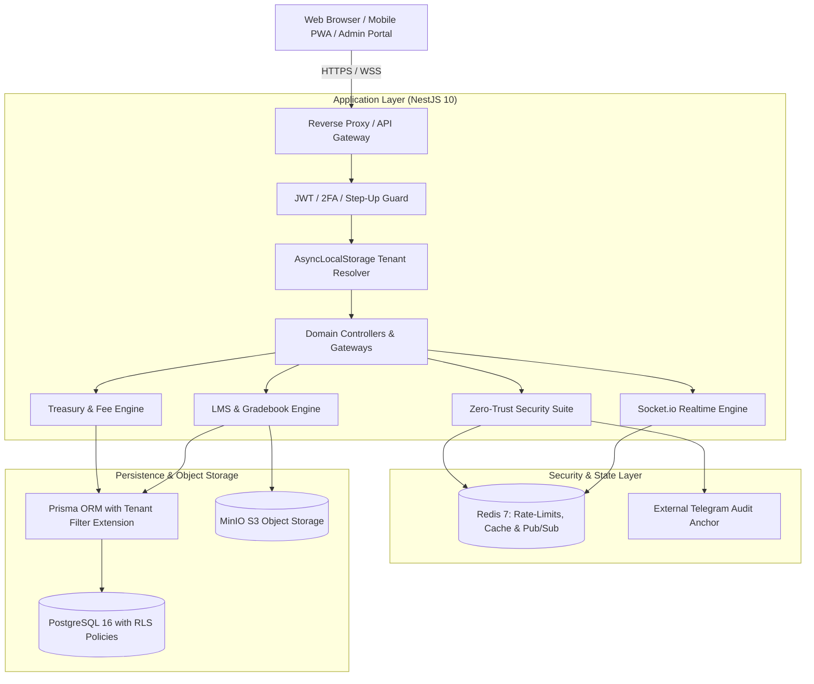

<p align="center">
  <a href="https://rokad.ir" target="_blank" rel="noopener noreferrer">
    <picture>
      <source media="(prefers-color-scheme: dark)" srcset="frontend/public/logo-rokad-white.svg">
      
    </picture>
  </a>
</p>

<h1 align="center">Rokad Platform</h1>

<p align="center">
  <strong>Enterprise Multi-Tenant School ERP, Next-Generation LMS & Academy Operating System</strong>
</p>

<p align="center">
  A mission-critical, cloud-native operating system designed for modern schools, technical colleges, and educational institutes. Powered by a <strong>Zero-Trust Security Suite</strong>, an advanced <strong>Treasury & Sayad Cheque Engine</strong>, real-time communications, and an offline-first <strong>Progressive Web App (PWA)</strong>.
</p>

<p align="center">
  <a href="README.fa.md"><strong>🇮🇷 مطالعه مستندات به زبان فارسی (Persian Documentation)</strong></a> •
  <a href="ARCHITECTURE.md"><strong>Architecture Deep-Dive</strong></a> •
  <a href="ROADMAP.md"><strong>Roadmap</strong></a> •
  <a href="CHANGELOG.md"><strong>Changelog</strong></a>
</p>

<p align="center">
  <a href="LICENSE"></a>
  <a href="https://nodejs.org/"></a>
  <a href="https://nestjs.com/"></a>
  <a href="https://react.dev/"></a>
  <a href="https://www.typescriptlang.org/"></a>
  <a href="https://www.postgresql.org/"></a>
  <a href="https://redis.io/"></a>
  <a href="https://min.io/"></a>
  <a href="https://socket.io/"></a>
  <a href="https://vitejs.dev/"></a>
  <a href="#-security-suite--cryptographic-guarantees"></a>
</p>

---

## 📑 Table of Contents

- [Executive Overview](#-executive-overview)
- [System Architecture](#-system-architecture)
- [Key Modules & Capabilities](#-key-modules--capabilities)
  - [1. Zero-Trust Security Suite](#1--zero-trust-security-suite)
  - [2. Treasury & Sayad Cheque Engine](#2--treasury--sayad-cheque-engine)
  - [3. Academic Operations & Cloud LMS](#3--academic-operations--cloud-lms)
  - [4. Real-Time Communications & PWA](#4--real-time-communications--pwa)
  - [5. SaaS Multi-Tenancy & Operations Control](#5--saas-multi-tenancy--operations-control)
- [Cryptographic Specifications](#-cryptographic-specifications)
- [Tech Stack & Infrastructure](#-tech-stack--infrastructure)
- [Quick Start in 3 Minutes](#-quick-start-in-3-minutes)
- [Default Seed Accounts](#-default-seed-accounts)
- [Monorepo Workspace Structure](#-monorepo-workspace-structure)
- [Interactive API Documentation](#-interactive-api-documentation)
- [Testing & Quality Assurance](#-testing--quality-assurance)
- [Contributing & Governance](#-contributing--governance)
- [License](#-license)

---

## 🌟 Executive Overview

Legacy educational software is notoriously fragmented, reliant on fragile desktop installations, and lacking in data privacy and real-time synchronization. **Rokad Platform** is engineered from the ground up as a unified, enterprise-grade Software-as-a-Service (SaaS) operating system.

### Core Architectural Pillars:
* **Defense-in-Depth Multi-Tenancy:** Guaranteed complete tenant isolation via dual-layer protection (Prisma ORM dynamic extensions + PostgreSQL Row-Level Security).
* **Cryptographic Data Protection:** Confidential student and financial records are protected by envelope encryption (**AES-256-GCM**) with **HMAC-SHA256 Blind Indexing** for performant encrypted queries.
* **Tamper-Evident Audit Trails:** Every system mutation produces a cryptographically chained log entry (`SHA-256 PrevHash`) anchored periodically to an external immutable medium (Telegram audit channel).
* **Automated Treasury:** Comprehensive management of Iranian Sayad Cheques with 16-digit verification, state machine lifecycle tracking, maturity reminder notifications, and direct Zarinpal online settlement.
* **Frictionless UX:** Tailored for Persian typography (IRANSansXFaNum), Jalali calendar workflows, mobile bottom-sheet ergonomics, and offline PWA capability.

---

## 🏗️ System Architecture



---

## 🧩 Key Modules & Capabilities

### 1. 🛡️ Zero-Trust Security Suite
Designed to meet the stringent security and compliance requirements of enterprise institutions:
* **RFC 6238 Two-Factor Authentication (2FA TOTP):** Native compatibility with Google Authenticator and Microsoft Authenticator, paired with SHA-256 hashed recovery codes.
* **Step-Up Authentication (`StepUpGuard`):** High-privilege administrative actions (role modifications, account deletions, financial debt overrides) require on-demand 6-digit TOTP re-verification.
* **AES-256-GCM Envelope Encryption:** Personal Identifiable Information (PII) such as national identification numbers and contact details are encrypted with a distinct per-record Data Encryption Key (DEK).
* **HMAC-SHA256 Blind Indexing:** Fast, exact-match queries over encrypted columns without ever decrypting database records into memory.
* **Chained Cryptographic Audit Logs with Telegram Anchoring:**
  * Implements a local blockchain-like ledger where every log contains `SHA-256(prevHash + payload)`.
  * External anchoring cron broadcasts cryptographic ledger digests to an external private Telegram channel, providing mathematical proof against insider log alteration.
* **Sliding-Window Anti-Brute-Force Rate Limiter:** Redis-backed rate limiting with progressive backoff penalties and IP blacklisting.

---

### 2. 💼 Treasury & Sayad Cheque Engine
A high-precision accounting system engineered specifically for educational fee administration:
* **`Decimal(15, 2)` Financial Precision:** Complete migration away from IEEE floating-point numbers, preventing fractional Rial/Toman rounding discrepancy.
* **Dynamic Debt Balancing:** Real-time calculation and tracking of each student's `balanceRemaining`.
* **Configurable Annual Fee Plans (`FeePlan`):** Create institutional fee models scoped to `ALL_SCHOOL`, `EDUCATIONAL_LEVEL`, or specific `CLASSROOM` targets, with atomic group allocation that creates student contracts in a single transaction.
* **Sayad Cheque Lifecycle Ledger (`FeePayment`):**
  * Strict validation for 16-digit Sayad IDs, series numbers, issuing bank, branch, and due date.
  * State machine transitions: `PENDING` (awaits maturity, no balance deduction), `CASHED` (deducts debt, issues official receipt), `BOUNCED` (flags `hasFinancialHold = true`), and `REPLACED` (links replacement cheque or cash).
* **Automated Maturity Reminders (`ChequeReminderScheduler`):** Daily cron job at 09:00 AM dispatching WebPush alerts and in-app messages to parents 3 days, 1 day, and on the morning of cheque maturity.
* **Two-Stage Excel Batch Import:** Pre-validates uploaded `.xlsx` files against database constraints, highlights row-specific errors with exact cell references, and executes valid imports atomically.
* **Multi-Child Parent Portal:** Guardians can toggle seamlessly between siblings, review upcoming installments, check cheque statuses, and settle debts via Zarinpal.

---

### 3. 🎓 Academic Operations & Cloud LMS
* **Curriculum & Schedule Scheduling:** Automated teacher allocation, course matrix management, and weekly classroom conflict detection.
* **Smart Gradebook:** Weighted continuous evaluation, mid-term and final grading, class ranking percentiles, and one-click PDF report card generation.
* **Online Assessment & Question Bank:** Timed multiple-choice and descriptive examinations with automated scoring and anti-cheat window blur tracking.
* **Digital Homework Portal:** Assignment distribution, student file uploads, deadline timers, and teacher rubric evaluation backed by MinIO S3 object storage.
* **Digital Attendance Register:** Daily period attendance tracking with instant automated absence notices sent to parents.

---

### 4. 💬 Real-Time Communications & PWA
* **Socket.io Real-Time Messaging:** Classroom group chats, administrative announcements, and direct teacher-parent consultations synchronized across multiple server nodes via `@socket.io/redis-adapter`.
* **VAPID WebPush Notifications:** Browser-level push alerts delivered even when the web application tab is inactive.
* **Parent-Teacher Conference Booking:** Interactive appointment calendar for scheduling one-on-one virtual or in-person parent consultations.
* **Offline-First Progressive Web App (PWA):** Service worker asset caching with Workbox, enabling instant cold starts and native mobile installation.

---

### 5. 🏢 SaaS Multi-Tenancy & Operations Control
* **Dual-Layer Tenant Isolation:** Strict tenant separation enforced at both the ORM layer (Prisma query extensions) and database kernel layer (PostgreSQL RLS).
* **SuperAdmin Operations Cockpit:** Real-time health metrics monitoring (PostgreSQL, Redis, MinIO, Heap memory, and CPU utilization).
* **Tenant Provisioning Engine:** One-click school tenant onboarding with automatic database schema alignment, initial role distribution, and custom subdomain binding.

---

## 🔒 Cryptographic Specifications

| Security Domain | Algorithm / Standard | Engineering Specification |
| :--- | :--- | :--- |
| **Password Storage** | Argon2id | Memory: `64 MB` (`m=65536`), Time: `3 iterations` (`t=3`), Parallelism: `4 lanes` |
| **PII Data Encryption** | AES-256-GCM | Envelope pattern: 256-bit Key, 96-bit random IV, 128-bit authentication tag |
| **Encrypted Search** | HMAC-SHA256 | Keyed blind index using server-side secret pepper (`BLIND_INDEX_PEPPER`) |
| **Two-Factor Auth** | RFC 6238 TOTP | SHA-1 HMAC, 30-second time-step, ±1 window drift tolerance, 8-character backup codes |
| **Audit Ledger Integrity** | Merkle / Hash Chain | SHA-256 previous hash link; Periodic external cryptographic digest broadcast |
| **Token Authentication** | JWT (RS256 / HS256) | Strict issuer/audience validation with Redis blacklist for revoked access tokens |

---

## 🛠️ Tech Stack & Infrastructure

```
Backend Core     : NestJS 10 (TypeScript 5.7)
Database         : PostgreSQL 16
ORM              : Prisma ORM 5.22
Cache & Queues   : Redis 7 (ioredis, @socket.io/redis-adapter)
Object Storage   : MinIO S3 Compatible
Frontend SPA/PWA : React 18 + Vite 6 + Tailwind CSS
Real-Time Engine : Socket.io 4.8
Task Scheduling  : NestJS Schedule (Cron)
Documentation    : OpenAPI 3.0 / Swagger UI
Containerization : Docker & Docker Compose
```

---

## ⚡ Quick Start in 3 Minutes

### Prerequisites
* **Node.js**: `v20.x` or `v22.x` (LTS recommended)
* **pnpm**: `v9.x` (`npm install -g pnpm`)
* **Docker & Docker Compose**

---

### Step 1: Clone Repository & Install Dependencies
```bash
git clone https://github.com/Rokad-Studio/Rokad-Platform.git
cd Rokad-Platform
pnpm install
```

### Step 2: Spin Up Infrastructure Containers
Start PostgreSQL 16, Redis 7, and MinIO S3 storage in detached mode:
```bash
docker-compose up -d
```

### Step 3: Configure Environment Variables
```bash
cp .env.example .env
```
*(Default settings in `.env.example` match the local `docker-compose.yml` services out-of-the-box).*

### Step 4: Run Database Migrations & Seed
```bash
pnpm prisma:generate
pnpm prisma db push
pnpm prisma:seed
```

### Step 5: Launch Development Servers
Open two terminal windows:

**Terminal 1 — Backend API (NestJS):**
```bash
pnpm start:dev
# API Server running at: http://localhost:4000/api/v1
# Swagger UI available at: http://localhost:4000/api/docs
```

**Terminal 2 — Frontend Client (Vite React PWA):**
```bash
pnpm --filter rokad-frontend dev
# Web App running at: http://localhost:3000
```

---

## 🔑 Default Seed Accounts

After executing `pnpm prisma:seed`, the database is populated with initial sample accounts for testing all system personas.

* **Universal Default Password:** `Admin@123456`

| Persona / Role | Username / Mobile | Primary Capabilities |
| :--- | :--- | :--- |
| **SuperAdmin** | `09120000001` | Multi-tenant SaaS console, tenant provisioning, system health |
| **School Admin** | `09120000002` | School academic terms, staff HR, fee contracts & Sayad cheque ledger |
| **Teacher** | `09120000003` | Classroom gradebook, attendance sheets, exam question creation |
| **Parent (Guardian)** | `09120000004` | Multi-child fee overview, online installment payment, cheque tracking |
| **Student** | `09120000005` | Homework submissions, online exams, personalized weekly timetable |

---

## 📁 Monorepo Workspace Structure

```text
rokad-platform/
├── .github/                      # GitHub Workflows, Automation & Community Health
│   ├── workflows/
│   │   ├── ci.yml                # Automated CI testing with Postgres & Redis services
│   │   ├── codeql.yml            # CodeQL Static Application Security Testing (SAST)
│   │   └── labeler.yml           # Automated PR path labeler
│   ├── ISSUE_TEMPLATE/           # Structured bug reports & feature requests
│   ├── PULL_REQUEST_TEMPLATE.md  # Standardized PR checklist & review guidelines
│   ├── SECURITY.md               # Security policy & vulnerability reporting procedures
│   ├── dependabot.yml            # Automated weekly dependency updates
│   └── labeler.yml               # PR categorization rules
├── prisma/                       # Prisma Database Layer
│   ├── schema.prisma             # Relational data schema & indexes
│   └── seed.ts                   # Initial RBAC permissions & sample tenant seed
├── src/                          # Backend Application Core (NestJS 10)
│   ├── common/                   # Cross-cutting concerns
│   │   ├── crypto/               # AES-256-GCM Envelope Encryption & HMAC Blind Index
│   │   ├── guards/               # JwtAuth, Roles, Permissions, StepUp Guards
│   │   └── constants/            # RBAC permissions catalog
│   └── modules/                  # Domain-Driven Feature Modules
│       ├── auth/                 # 2FA TOTP, session manager, rate limiting
│       ├── finance/              # Treasury, Sayad cheques, Excel import, Zarinpal
│       ├── academic/             # Academic years, curriculums, educational levels
│       ├── classes/              # Classrooms, student enrollment, schedule matrices
│       ├── gradebook/            # Continuous evaluation, transcripts, PDF cards
│       ├── exams/                # Online assessment engine & question bank
│       ├── homework/             # Assignments & MinIO S3 file uploads
│       ├── chat/                 # Real-time WebSocket messaging & channels
│       ├── notifications/        # VAPID WebPush & transactional alerts
│       ├── audit-log/            # Cryptographic hash chains & Telegram anchor
│       └── saas-admin/           # Multi-tenant supervisor, telemetry & branding
├── frontend/                     # Client Application (React 18 + Vite 6 PWA)
│   ├── src/
│   │   ├── components/ui/        # Custom Design System primitives (RTL tailored)
│   │   ├── modules/              # Persona-based route modules
│   │   │   ├── super-admin/      # SaaS platform infrastructure & metrics
│   │   │   ├── school-admin/     # Academic, HR, and finance management
│   │   │   ├── teacher/          # Grading, attendance, homework review
│   │   │   └── student-parent/   # Student portal & multi-child parent fee views
│   │   └── lib/api/              # Axios client with automatic JWT token refresh
│   └── vite.config.ts            # Vite bundler, PWA manifest & service workers
├── docker-compose.yml            # PostgreSQL 16, Redis 7, MinIO S3 local environment
├── package.json                  # Root dependencies & workspace scripts
├── ARCHITECTURE.md               # Architectural specification & tenant isolation model
├── CHANGELOG.md                  # Standard version release history
├── CONTRIBUTING.md               # Engineering guidelines & Conventional Commits
├── CODE_OF_CONDUCT.md           # Contributor Covenant Code of Conduct
├── ROADMAP.md                    # Strategic product & technical roadmap
├── LICENSE                       # MIT Open-Source License
└── README.fa.md                  # Complete Persian documentation
```

---

## 📚 Interactive API Documentation

Rokad Platform provides built-in Swagger / OpenAPI 3.0 interactive documentation:

* **Local Documentation URL:** [http://localhost:4000/api/docs](http://localhost:4000/api/docs)
* **Bearer Token Authorization:** Easily authorize requests by entering your JWT token in the Swagger UI `Authorize` modal.

---

## 🧪 Testing & Quality Assurance

```bash
# Execute unit test suites
pnpm test

# Run end-to-end integration tests
pnpm test:e2e

# Validate TypeScript type safety
pnpm build
pnpm --filter rokad-frontend build

# Verify Prisma schema validity
npx prisma validate

# Execute atomic treasury & financial calculations test
npx ts-node scratch/test-finance-engine.ts
```

---

## 🤝 Contributing & Governance

Contributions to Rokad Platform are welcome! Please consult the governance guidelines prior to submitting Pull Requests:

* [Contribution Guidelines (CONTRIBUTING.md)](CONTRIBUTING.md)
* [Code of Conduct (CODE_OF_CONDUCT.md)](CODE_OF_CONDUCT.md)
* [Security Policy & Disclosure (.github/SECURITY.md)](.github/SECURITY.md)

---

## 📄 License

Rokad Platform is open-source software licensed under the [MIT License](LICENSE).

<p align="center">
  <sub>Architected and engineered with ❤️ by <strong>Rokad Studio Team</strong></sub>
</p>
