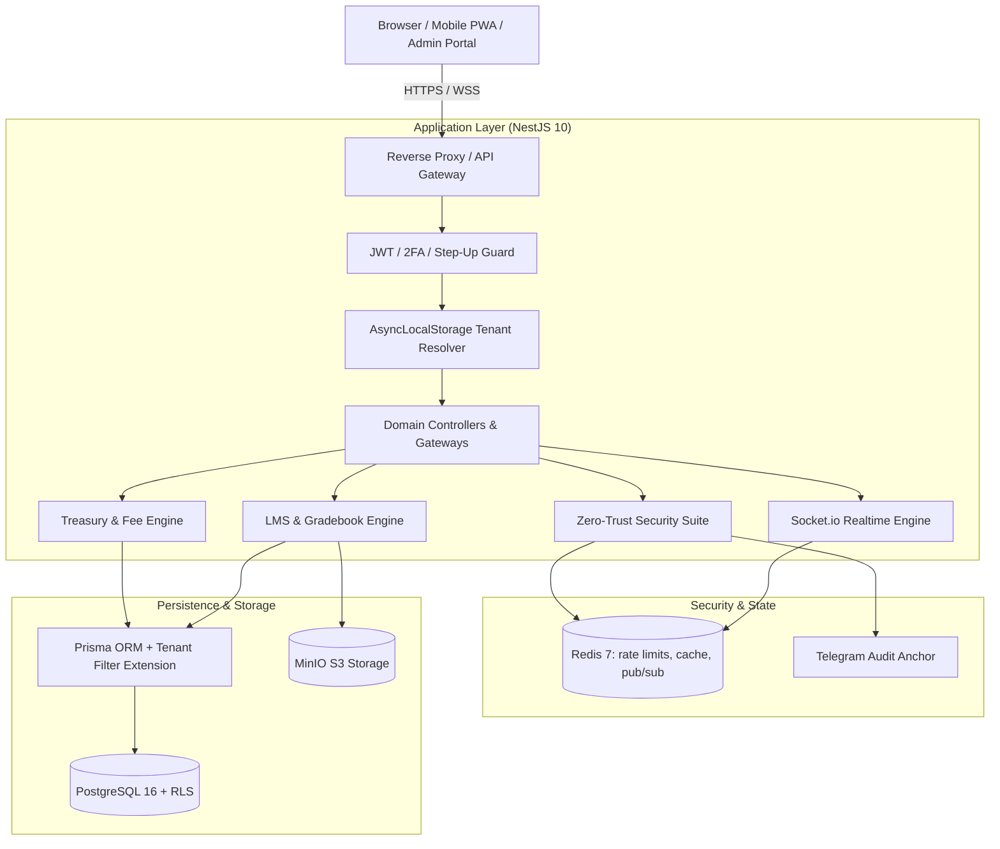

<p align="center">
  <a href="https://rokad.ir" target="_blank" rel="noopener noreferrer">
    <picture>
      <source media="(prefers-color-scheme: dark)" srcset="frontend/public/logo-rokad-white.svg">
      
    </picture>
  </a>
</p>

<h1 align="center">Rokad Platform</h1>

<p align="center">
  <strong>The multi-tenant operating system for schools, technical colleges and academies.</strong><br/>
  School ERP · LMS · Treasury &amp; Sayad Cheques · Real-time Chat · Offline-first PWA
</p>

<p align="center">
  <a href="LICENSE"></a>
  
  
  
  
  
  
  
</p>

<p align="center">
  <a href="#-quick-start"><strong>Quick Start</strong></a> ·
  <a href="ARCHITECTURE.md"><strong>Architecture</strong></a> ·
  <a href="ROADMAP.md"><strong>Roadmap</strong></a> ·
  <a href="CHANGELOG.md"><strong>Changelog</strong></a> ·
  <a href="README.fa.md"><strong>🇮🇷 مستندات فارسی</strong></a>
</p>

---

## ✨ Why Rokad?

School software is usually a patchwork of desktop installs, spreadsheets and chat groups, with weak privacy and no real-time sync. Rokad replaces that with **one cloud-native platform** built for how Iranian schools actually work: Jalali calendars, Persian typography, Sayad cheques and Zarinpal payments, on mobile first.

| | |
| :-- | :-- |
| 🛡️ **Security by design** | Envelope-encrypted PII, blind-indexed search, TOTP 2FA, step-up auth and a tamper-evident audit chain |
| 🏢 **True multi-tenancy** | Isolation enforced twice: in the ORM *and* in the database kernel (PostgreSQL RLS) |
| 💰 **Built-in treasury** | Fee plans, installments, Sayad cheque lifecycle, reminders and online settlement |
| 🎓 **Complete academics** | Attendance, gradebook, exams, homework, lesson plans, coaching and more |
| 💬 **Real-time everywhere** | Socket.io chat across nodes, Web Push notifications, SMS |
| 📱 **Installable PWA** | Offline-capable, RTL-native, with a mobile bottom-sheet UX |

---

## 📑 Table of Contents

- [Architecture](#-architecture)
- [Feature Highlights](#-feature-highlights)
- [All 31 Modules](#-all-31-modules)
- [Cryptographic Specifications](#-cryptographic-specifications)
- [Tech Stack](#-tech-stack)
- [Quick Start](#-quick-start)
- [Seed Accounts](#-seed-accounts)
- [Project Structure](#-project-structure)
- [API Documentation](#-api-documentation)
- [Testing](#-testing)
- [Contributing](#-contributing)
- [License](#-license)

---

## 🏗️ Architecture


```mermaid
graph TD
    Client[Browser / Mobile PWA / Admin Portal] -->|HTTPS / WSS| Gateway[Reverse Proxy / API Gateway]

    subgraph "Application Layer (NestJS 10)"
        Gateway --> AuthGuard[JWT / 2FA / Step-Up Guard]
        AuthGuard --> TenantMW[AsyncLocalStorage Tenant Resolver]
        TenantMW --> Controller[Domain Controllers & Gateways]

        Controller --> SecModule[Zero-Trust Security Suite]
        Controller --> FinModule[Treasury & Fee Engine]
        Controller --> AcadModule[LMS & Gradebook Engine]
        Controller --> ChatModule[Socket.io Realtime Engine]
    end

    subgraph "Security & State"
        SecModule --> Redis[(Redis 7: rate limits, cache, pub/sub)]
        SecModule --> ExtAnchor[Telegram Audit Anchor]
        ChatModule --> Redis
    end

    subgraph "Persistence & Storage"
        FinModule --> Prisma[Prisma ORM + Tenant Filter Extension]
        AcadModule --> Prisma
        Prisma --> Postgres[(PostgreSQL 16 + RLS)]
        AcadModule --> MinIO[(MinIO S3 Storage)]
    end
```

> Full design notes and the tenant-isolation model live in [ARCHITECTURE.md](ARCHITECTURE.md).

<!-- 📸 Add screenshots here:
<p align="center">
  
  
</p>
-->

---

## 🌟 Feature Highlights

### 🛡️ Zero-Trust Security Suite

- **2FA (RFC 6238 TOTP)**: works with Google and Microsoft Authenticator; recovery codes are stored as SHA-256 hashes.
- **Step-Up Authentication (`StepUpGuard`)**: sensitive actions (role changes, account deletion, debt overrides) require a fresh 6-digit TOTP.
- **AES-256-GCM envelope encryption**: PII such as national IDs and contact details is encrypted with a unique per-record data key.
- **HMAC-SHA256 blind indexing**: exact-match search over encrypted columns without decrypting records.
- **Tamper-evident audit log**: each entry stores `SHA-256(prevHash + payload)`; a cron job periodically anchors the ledger digest in a private Telegram channel, so insider edits become provable.
- **Adaptive rate limiting**: Redis sliding window with progressive back-off and IP blacklisting.

### 💼 Treasury & Sayad Cheque Engine

- **Exact money math**: `Decimal(15, 2)` throughout, with no floating-point rounding drift.
- **Fee plans (`FeePlan`)**: scope to `ALL_SCHOOL`, `EDUCATIONAL_LEVEL` or `CLASSROOM`; student contracts are created atomically in a single transaction.
- **Sayad cheque ledger (`FeePayment`)**: validates the 16-digit Sayad ID, series, bank, branch and due date.

  ```mermaid
  stateDiagram-v2
      [*] --> PENDING
      PENDING --> CASHED: matures & clears
      PENDING --> BOUNCED: returned
      BOUNCED --> REPLACED: new cheque / cash
      CASHED --> [*]
      REPLACED --> [*]
  ```

  | State | Effect |
  | :-- | :-- |
  | `PENDING` | Awaiting maturity, no balance change |
  | `CASHED` | Deducts debt and issues an official receipt |
  | `BOUNCED` | Sets `hasFinancialHold = true` |
  | `REPLACED` | Links the replacement cheque or cash payment |

- **Maturity reminders**: a daily 09:00 cron sends Web Push and in-app alerts to parents 3 days before, 1 day before and on the morning of maturity.
- **Two-stage Excel import**: validate first (errors reported by exact cell), then import valid rows atomically.
- **Multi-child parent portal**: switch between siblings, track installments and cheques, and pay via Zarinpal.

### 🎓 Academic Operations & LMS

- **Scheduling**: teacher allocation, course matrices and weekly conflict detection.
- **Smart gradebook**: weighted continuous assessment, midterm/final grades, class percentiles and one-click PDF report cards.
- **Exams & question bank**: timed multiple-choice and descriptive exams, auto-scoring and anti-cheat tab-blur tracking.
- **Homework portal**: file uploads (MinIO), deadline timers and rubric-based review.
- **Attendance**: per-period registers with instant absence alerts to parents.

### 💬 Communications & PWA

- **Socket.io chat**: class groups, announcements and teacher–parent conversations, synced across nodes via `@socket.io/redis-adapter`.
- **VAPID Web Push**: alerts even when the tab is closed.
- **Parent–teacher booking**: appointment calendar for in-person or virtual meetings.
- **Offline-first PWA**: Workbox caching, fast cold starts, installable on mobile.

### 🏢 SaaS Operations

- **Dual-layer tenant isolation**: Prisma query extensions plus PostgreSQL Row-Level Security.
- **SuperAdmin cockpit**: live health of PostgreSQL, Redis, MinIO, heap memory and CPU.
- **One-click tenant provisioning**: schema alignment, initial roles and custom subdomain binding.

---

## 🧩 All 31 Modules

The backend is split into **31 decoupled NestJS modules**. The frontend mirrors them through role-based dashboards (Super Admin, School Admin, Teacher, Student/Parent, Club, Ka Platform).

<details>
<summary><strong>🔐 Infrastructure & Security (7)</strong></summary>

| Module | Responsibility |
| :-- | :-- |
| `tenants` | Tenant isolation, branding (Male, Female, Ecosystem), subdomains |
| `saas-admin` | Provisioning, subscriptions, impersonation, quotas |
| `auth` | Token-family rotation, 2FA, password vault |
| `rbac` | Dynamic roles and permission overrides |
| `feature-flags` | Per-tenant module toggles |
| `audit-log` | Cryptographically anchored audit trail |
| `health` | Liveness, readiness, Redis/DB heartbeat |

</details>

<details>
<summary><strong>🏫 Core ERP & Operations (11)</strong></summary>

| Module | Responsibility |
| :-- | :-- |
| `academic` | Academic years, terms, study fields |
| `classes` | Lessons, classrooms, scheduling |
| `members` | Students, teachers, staff, parents (with parent–student links) |
| `profiles` | Media, bios, internal social blogs |
| `attendance` | Bulk attendance, history, parent alerts |
| `calendar` | Jalali/Gregorian schedules and events |
| `homework` | Assignment creation, upload and review |
| `matters` | Disciplinary records: points, actions, parent notices |
| `parent-visits` | Appointment slots and bookings |
| `polls` | Forms and analytics |
| `coaching` | Student mentoring, health and academic check-ins |

</details>

<details>
<summary><strong>📚 LMS & Assessment (5)</strong></summary>

| Module | Responsibility |
| :-- | :-- |
| `question-bank` | Reusable question repository |
| `exams` | Online exam engine and participations |
| `gradebook` | Matrix grading, report cards, dossiers |
| `lesson-plans` | Teacher syllabus and session tracking |
| `learning-materials` | Secure study resources on S3/MinIO |

</details>

<details>
<summary><strong>💰 Finance & HR (2)</strong></summary>

| Module | Responsibility |
| :-- | :-- |
| `finance` | Fee plans, installments, Sayad cheques, bulk import, Zarinpal |
| `payroll` | Teacher contracts, dynamic pay slips, exports |

</details>

<details>
<summary><strong>📣 Communications (4)</strong></summary>

| Module | Responsibility |
| :-- | :-- |
| `messages` | Formal internal inbox |
| `chat` | Real-time class and direct messaging |
| `notifications` | In-app and Web Push notifications |
| `sms` | Amoot SMS integration and queueing |

</details>

<details>
<summary><strong>🎮 Student Life & Gamification (2)</strong></summary>

| Module | Responsibility |
| :-- | :-- |
| `ka` | Virtual economy, activity submissions, rewards, leaderboards |
| `club` | Student clubs, challenges, teacher approvals |

</details>

---

## 🔒 Cryptographic Specifications

| Domain | Standard | Specification |
| :-- | :-- | :-- |
| **Passwords** | Argon2id | 64 MB memory (`m=65536`), 3 iterations (`t=3`), 4 lanes |
| **PII encryption** | AES-256-GCM | Envelope pattern, 256-bit key, 96-bit random IV, 128-bit auth tag |
| **Encrypted search** | HMAC-SHA256 | Keyed blind index with server-side pepper (`BLIND_INDEX_PEPPER`) |
| **Two-factor auth** | RFC 6238 TOTP | SHA-1 HMAC, 30 s step, ±1 window, 8-character backup codes |
| **Audit integrity** | SHA-256 hash chain | Previous-hash linking plus periodic external digest broadcast |
| **Tokens** | JWT (RS256 / HS256) | Strict issuer/audience checks, Redis blacklist for revoked tokens |

Found a vulnerability? See the [Security Policy](.github/SECURITY.md).

---

## 🛠️ Tech Stack

| Layer | Technology |
| :-- | :-- |
| Backend | NestJS 10, TypeScript 5.7 |
| Database / ORM | PostgreSQL 16, Prisma 5.22 |
| Cache & queues | Redis 7 (ioredis, `@socket.io/redis-adapter`) |
| Object storage | MinIO (S3-compatible) |
| Frontend | React 18, Vite 6, Tailwind CSS (PWA, RTL) |
| Real-time | Socket.io 4.8 |
| Scheduling | `@nestjs/schedule` (cron) |
| API docs | OpenAPI 3.0 / Swagger UI |
| Infrastructure | Docker & Docker Compose |

---

## ⚡ Quick Start

**Prerequisites:** Node.js 20 or 22 · pnpm 9 (`npm i -g pnpm`) · Docker & Docker Compose

```bash
# 1. Clone and install
git clone https://github.com/Rokad-Studio/Rokad-Platform.git
cd Rokad-Platform
pnpm install

# 2. Start PostgreSQL 16, Redis 7 and MinIO
docker-compose up -d

# 3. Configure environment (defaults match docker-compose.yml)
cp .env.example .env

# 4. Generate the client, sync the schema and seed data
pnpm prisma:generate
pnpm prisma db push
pnpm prisma:seed
```

Then run the two servers in separate terminals:

| Terminal | Command | URL |
| :-- | :-- | :-- |
| Backend (NestJS) | `pnpm start:dev` | API `http://localhost:4000/api/v1` · Swagger `http://localhost:4000/api/docs` |
| Frontend (Vite PWA) | `pnpm --filter rokad-frontend dev` | `http://localhost:3000` |

---

## 🔑 Seed Accounts

After `pnpm prisma:seed`, every persona below can sign in with the password **`Admin@123456`**.

| Role | Mobile | What you can try |
| :-- | :-- | :-- |
| **SuperAdmin** | `09120000001` | Tenant provisioning, system health |
| **School Admin** | `09120000002` | Terms, staff HR, fee contracts, Sayad ledger |
| **Teacher** | `09120000003` | Gradebook, attendance, exam questions |
| **Parent** | `09120000004` | Multi-child fees, online payment, cheque tracking |
| **Student** | `09120000005` | Homework, online exams, weekly timetable |

> ⚠️ **For local development only.** Never ship these credentials to staging or production: change every secret, key and password before deploying.

---

## 📁 Project Structure

```text
rokad-platform/
├── .github/                 # CI, CodeQL, labeler, templates, SECURITY.md, Dependabot
├── prisma/                  # schema.prisma + seed.ts
├── src/                     # Backend (NestJS 10)
│   ├── common/
│   │   ├── crypto/          # AES-256-GCM envelope encryption, HMAC blind index
│   │   ├── guards/          # JwtAuth, Roles, Permissions, StepUp
│   │   └── constants/       # RBAC permission catalog
│   └── modules/             # 31 domain modules (auth, finance, gradebook, chat, ...)
├── frontend/                # React 18 + Vite 6 PWA
│   └── src/
│       ├── components/ui/   # RTL-first design system
│       ├── modules/         # super-admin · school-admin · teacher · student-parent
│       └── lib/api/         # Axios client with automatic JWT refresh
├── docker-compose.yml       # PostgreSQL, Redis, MinIO
├── ARCHITECTURE.md · ROADMAP.md · CHANGELOG.md · CONTRIBUTING.md
├── CODE_OF_CONDUCT.md · LICENSE · README.fa.md
└── package.json
```

---

## 📚 API Documentation

Interactive OpenAPI 3.0 docs are served at **[http://localhost:4000/api/docs](http://localhost:4000/api/docs)**. Click **Authorize** and paste your JWT to call protected endpoints.

---

## 🧪 Testing

```bash
pnpm test                          # unit tests
pnpm test:e2e                      # end-to-end tests
pnpm build                         # backend type-check & build
pnpm --filter rokad-frontend build # frontend build
npx prisma validate                # schema validation
npx ts-node scratch/test-finance-engine.ts   # treasury calculation check
```

CI runs tests against real PostgreSQL and Redis services, and CodeQL scans every change for security issues.

---

## 🤝 Contributing

Contributions are welcome. Please read:

- [CONTRIBUTING.md](CONTRIBUTING.md): workflow and Conventional Commits
- [CODE_OF_CONDUCT.md](CODE_OF_CONDUCT.md)
- [Security Policy](.github/SECURITY.md): responsible disclosure

---

## 📄 License

Released under the [MIT License](LICENSE).

<p align="center">
  <sub>Built with 💚 by the <strong>Rokad Studio</strong> team</sub>
</p>